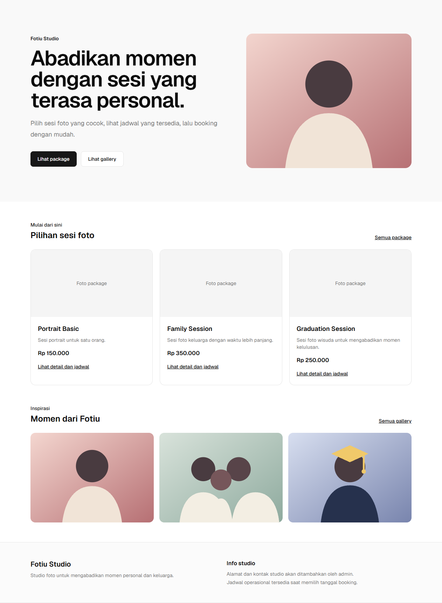

# Fotiu

Aplikasi booking dan manajemen untuk satu studio foto. Product requirements,
technical design, dan roadmap ada di [`docs/`](docs/).

## Pratinjau



Ini screenshot lokal dengan data seed development; belum merupakan demo
production.

## Menjalankan secara lokal

1. Gunakan Node.js 20.19+ atau 22.12+ (CI berjalan dengan Node.js 24).
2. Salin `.env.example` menjadi `.env`.
3. Jalankan `docker compose up -d` untuk menyalakan PostgreSQL lokal.
4. Jalankan `npm ci`, `npm run db:migrate`, `npm run db:seed`, lalu `npm run dev`.

Set `ADMIN_SEED_EMAIL` dan `ADMIN_SEED_PASSWORD` di `.env` sebelum menjalankan
`npm run db:seed`. Seed memakai bcrypt dengan cost 12.

Untuk database production, gunakan `npm run db:seed:production` dengan
`DATABASE_URL_PRODUCTION` dan `PRODUCTION_SEED_TARGET` dari secret manager atau
environment terminal production. `PRODUCTION_SEED_TARGET` harus sama dengan
`<hostname>/<nama-database>` pada `DATABASE_URL_PRODUCTION`; script menolak
database lokal dan tidak memakai `DATABASE_URL` development. Seed ini hanya membuat tiga customer sintetis dengan
email `.invalid` serta booking demo historis berstatus `CANCELLED`. Package
aktif harus sudah tersedia; seed tidak membuat admin, jam operasional, package,
payment, atau gallery. Jangan menaruh kredensial production di repository atau
mengirimkannya melalui chat.

Login Google memerlukan OAuth client. Isi `AUTH_GOOGLE_ID` dan
`AUTH_GOOGLE_SECRET` di `.env`, lalu daftarkan callback lokal
`http://localhost:3000/api/auth/callback/google` pada Google OAuth client.
Login admin memakai akun yang dibuat seed dan tersedia di `/admin/login`;
customer masuk melalui `/login`.

Compose membuat database `fotiu_test` saat volume PostgreSQL diinisialisasi.
Jika volume sudah ada sebelum konfigurasi ini, buat sekali dengan
`docker compose exec -T postgres createdb -U postgres fotiu_test`. Pastikan
`TEST_DATABASE_URL` menunjuk ke database tersebut, lalu jalankan
`npm run test:integration`. Test ini menjalankan migration pada database test
sebelum menguji constraint.

Perintah pemeriksaan:

```sh
npm run lint
npm run typecheck
npm run test
npm run test:integration
npm run test:e2e
```

`test:integration` dan `test:e2e` hanya memakai database bernama `fotiu_test`.
E2E menjalankan migration dan seed, membuat production build lokal, lalu
memeriksa alur customer, webhook lokal bertanda tangan, alur admin/photo
session, header keamanan, dan tiga halaman publik pada viewport HP. Untuk
mempercepat iterasi lokal setelah build tersedia, jalankan
`$env:E2E_SKIP_BUILD="1"; npm run test:e2e` di PowerShell. CI menjalankan build
E2E penuh. Workflow CI ada di `.github/workflows/ci.yml`.

Untuk transaksi QRIS sandbox, isi `MIDTRANS_SERVER_KEY` dan pastikan
`MIDTRANS_ENVIRONMENT="sandbox"`. Di detail booking, aplikasi menampilkan
URL gambar QR dan tautan QRIS Simulator Midtrans. Masukkan URL gambar QR ke
[simulator sandbox](https://simulator.sandbox.midtrans.com/openapi/qris/index)
untuk mensimulasikan pembayaran; ikuti [panduan resmi sandbox](https://docs.midtrans.com/docs/testing-payment-on-sandbox).
Jangan membayar QR sandbox memakai aplikasi bank atau e-wallet sungguhan.
Midtrans memperingatkan dana dapat masuk ke tujuan yang tidak dapat dipulihkan.

Untuk konfirmasi otomatis, URL notifikasi Midtrans harus dapat dijangkau dari
internet pada `/api/webhooks/payment`; alamat `localhost` saja tidak dapat
menerima notifikasi dari provider. Saat hanya menguji handler webhook secara
lokal tanpa notifikasi provider, gunakan script berikut untuk membuat payload
settlement bertanda tangan:

```sh
npm run payment:simulate -- <booking-code>
```

Script tersebut menolak berjalan jika APP_URL atau database bukan localhost.
Payload sintetis menguji handler aplikasi, tetapi bukan bukti settlement telah
terjadi pada Midtrans.

Compose hanya menjalankan satu database PostgreSQL untuk development lokal.
Project Supabase production sudah tersedia; gunakan database lokal terpisah
untuk development dan jangan memakai data production secara lokal.

## Gallery storage

Upload admin menggunakan presigned PUT ke object storage S3-compatible. Atur
semua `STORAGE_*` di `.env` (lihat `.env.example`), izinkan origin `APP_URL`
untuk PUT dengan header `Content-Type` pada CORS bucket, dan pastikan objek
dapat dibaca melalui `STORAGE_PUBLIC_URL`. Tanpa konfigurasi ini, UI memberi
tahu bahwa upload belum tersedia. Batas upload 10 MiB; tipe yang diterima
JPEG, PNG, dan WebP.

## Demo booth FreeBooth

FreeBooth berjalan di komputer studio dengan operator manual; agent Fotiu hanya
mengirim heartbeat dan tidak mengontrol sesi atau menebak status completion.
Ikuti [panduan demo FreeBooth](docs/FREEBOOTH-DEMO.md) untuk provisioning,
pengaturan agent, dan alur booking.

## Status deployment

Demo deployment: [fotiu.vercel.app](https://fotiu.vercel.app). Supabase,
migration, seed admin, dan Midtrans sandbox sudah dikonfigurasi. Login Google
memerlukan redirect URI production pada Google Cloud; upload galeri memerlukan
konfigurasi storage. Settlement QRIS lewat webhook Midtrans dan alur agent
photobooth pada deployment ini masih perlu diverifikasi. Screenshot di atas
masih pratinjau lokal.
