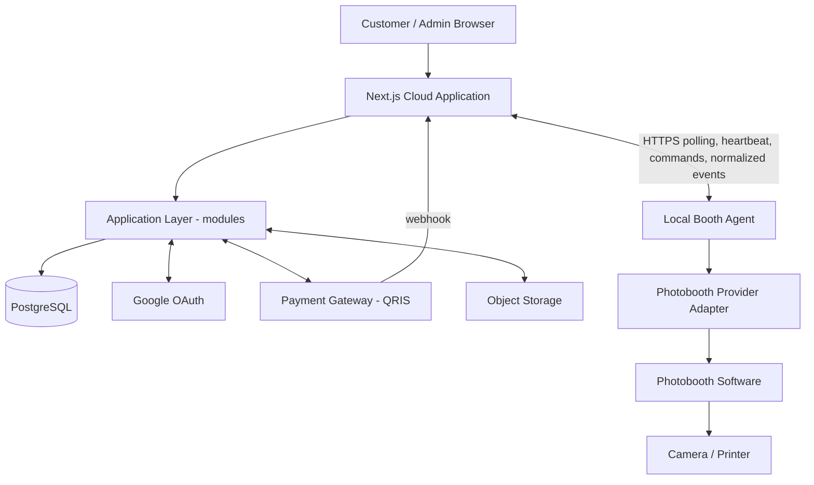
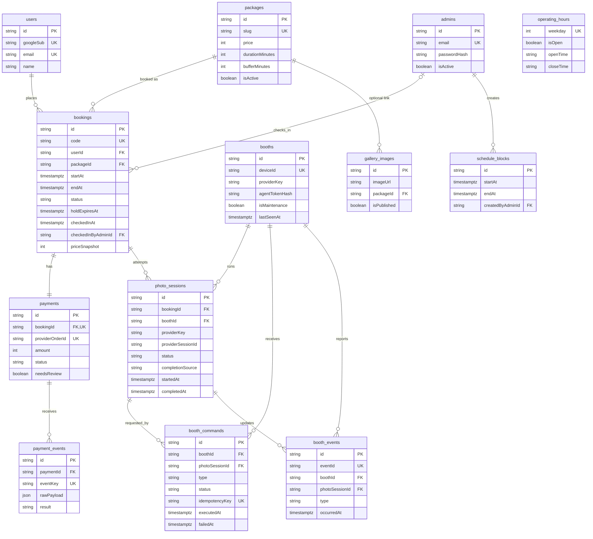
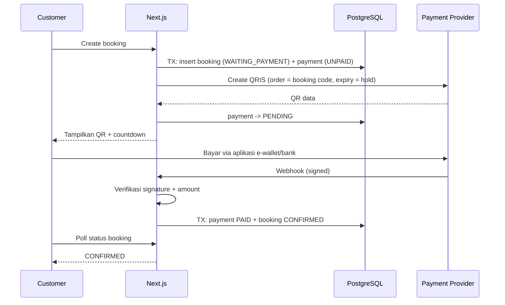
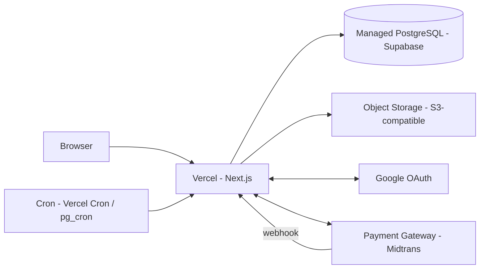
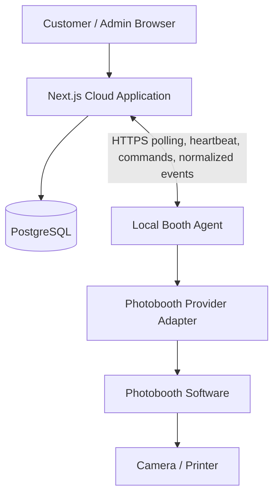
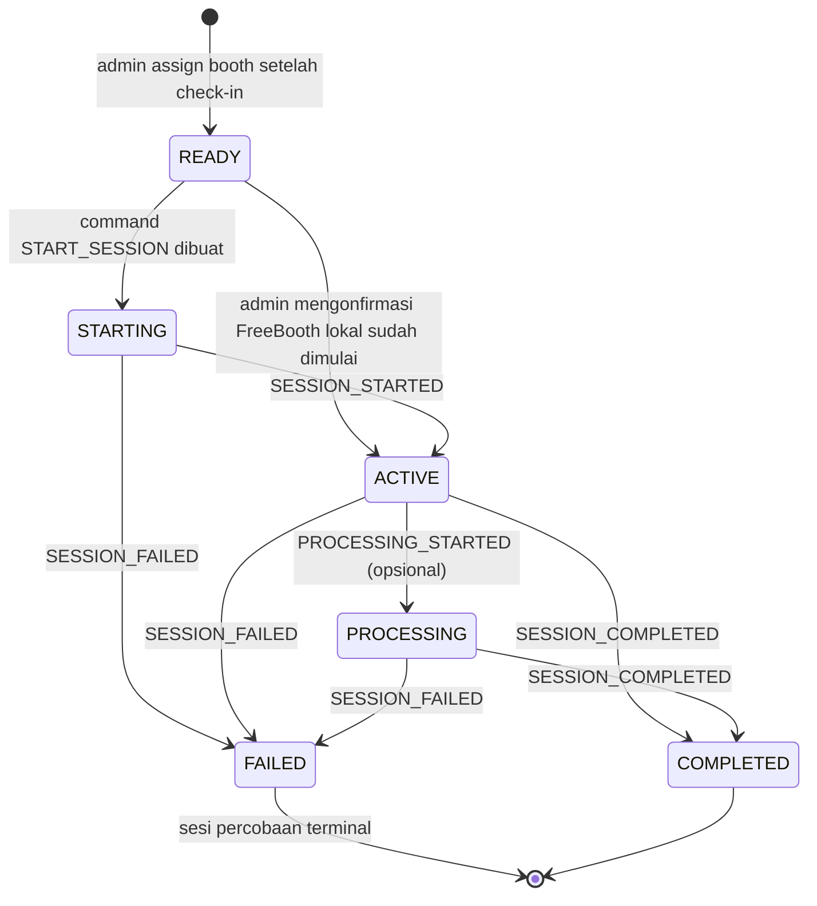

# Technical & Product Design

## 1. Design Principles

- **Simple before scalable.** Satu studio, satu database, satu deployment.
- **Server is source of truth.** UI hanya menampilkan, tidak memutuskan.
- **Database consistency over UI assumptions.** Aturan penting ditegakkan di database.
- **MVP first.** Selesaikan alur end-to-end sebelum fitur tambahan.
- **Avoid unnecessary abstraction.** Abstraksi dibuat setelah ada kebutuhan nyata.

## 2. High-Level Architecture



Semua logika berjalan di dalam satu aplikasi Next.js. Server Components dan Server Actions dipakai untuk UI. Route Handlers hanya dipakai untuk endpoint yang membutuhkan HTTP: webhook, availability, status polling, dan cron.

## 3. Architecture Decision

**Modular Monolith**: satu codebase dan satu deployment, dengan kode dipisah per modul domain.

| Aspek                       | Modular Monolith          | Microservices                        |
| --------------------------- | ------------------------- | ------------------------------------ |
| Deployment                  | Satu unit                 | Banyak unit                          |
| Transaksi booking + payment | Satu transaction database | Butuh saga atau eventual consistency |
| Kompleksitas operasional    | Rendah                    | Tinggi                               |
| Cocok untuk 1 developer     | Ya                        | Tidak                                |
| Biaya                       | Rendah                    | Lebih tinggi                         |

Microservices belum diperlukan karena beban kecil (satu studio), tim satu orang, dan konsistensi booking-payment jauh lebih mudah dijaga dalam satu database. Jika suatu modul kelak perlu dipisah, batas modul yang jelas memudahkan hal itu.

## 4. Application Modules

Struktur folder cloud: `src/app` (routes dan UI) memanggil `src/modules/<name>` (logika dan akses data). Modul cukup berisi `queries.ts`, `actions.ts`, `service.ts` (hanya jika ada business logic), dan `schemas.ts` (Zod). Tidak ada layer repository terpisah, Prisma dipanggil langsung dari modul. Local Booth Agent adalah service kecil pada komputer studio, bukan microservice cloud dan tidak berbagi customer/admin authentication.

| Modul          | Responsibility                                                                                            |
| -------------- | --------------------------------------------------------------------------------------------------------- |
| `auth`         | Konfigurasi Auth.js, guard `requireCustomer()` dan `requireAdmin()`, hashing password admin               |
| `photobooth`   | Booth, check-in, photo session, command/event handling, heartbeat, agent authentication, provider adapter |
| `users`        | Upsert customer dari Google, daftar customer (admin)                                                      |
| `packages`     | CRUD package, aktivasi, query publik                                                                      |
| `availability` | Jam operasional, schedule block, kalkulasi slot                                                           |
| `booking`      | Membuat, membatalkan, reschedule, complete, expiry, state machine                                         |
| `payment`      | Membuat QRIS via provider, mapping status, memproses webhook                                              |
| `admin`        | Query dashboard dan ringkasan (agregasi)                                                                  |
| `gallery`      | Gambar gallery dan upload                                                                                 |
| `lib`          | Prisma client, konfigurasi, util waktu, logger, error types                                               |

Aturan dependensi: `booking` boleh memanggil `availability` dan `payment`; `photobooth` memakai fungsi transisi `booking` hanya untuk completion/cancel orchestration yang terpusat. Modul lain tidak saling memanggil sembarangan. `payment` memanggil `booking` hanya lewat fungsi konfirmasi. Provider adapter tidak memanggil modul booking/payment atau mengubah state database secara langsung.

## 5. Authentication Design

**Library:** Auth.js (next-auth v5) dengan **JWT session**. JWT dipilih karena Credentials provider mengharuskannya dan tidak butuh tabel session. Token memuat `id` dan `role` (`CUSTOMER` atau `ADMIN`).

### Customer Authentication

- Provider Google OAuth.
- Pada callback `signIn`, upsert ke tabel `users` berdasarkan `googleSub`. Email diambil dari profil Google yang terverifikasi.
- Tidak ada password customer.
- Redirect setelah login diarahkan ke `callbackUrl` yang divalidasi sebagai path internal (mencegah open redirect).

### Admin Authentication

- Credentials provider (email dan password) yang membaca tabel `admins`.
- **Password hashing:** `argon2` atau `bcryptjs` (bcrypt cost ≥ 12). `bcryptjs` lebih mudah di serverless karena pure JS.
- Saat email tidak ditemukan tetap lakukan hash compare dummy agar waktu respons seragam.
- Pesan error login generik ("email atau password salah").
- Admin dibuat lewat script seed, tanpa halaman registrasi.
- Akun admin dapat dinonaktifkan (`isActive`) dan status ini dicek pada login dan guard.
- Rate limiting login memakai tabel PostgreSQL `admin_login_attempts`, dengan kunci SHA-256 dari email yang sudah dinormalisasi. Lima kegagalan dalam jendela 15 menit mengunci percobaan untuk email itu selama 15 menit; password tetap dibandingkan dengan hash dummy saat terkunci.

### Protected Routes dan Authorization Server-Side

- `middleware` hanya sebagai optimasi UX (redirect cepat), **bukan** pertahanan utama.
- Pertahanan utama: setiap Server Action, Route Handler, dan query data memanggil `requireCustomer()` atau `requireAdmin()` di server.
- Guard mengambil identitas dari session server, tidak pernah dari input client.
- Untuk `requireAdmin()`, admin dicek ulang ke database (`isActive`) pada operasi mutasi.

## 6. Authorization Design

| Resource            | Guest | Customer                           | Admin                |
| ------------------- | ----- | ---------------------------------- | -------------------- |
| Packages (aktif)    | Read  | Read                               | Read (semua)         |
| Gallery             | Read  | Read                               | Read + Manage        |
| Availability        | Read  | Read                               | Read + Manage        |
| Own Booking         | -     | Read, Create, Cancel (aturan)      | Read, Manage         |
| Other Booking       | -     | Tidak ada akses (404)              | Read, Manage         |
| Package Management  | -     | -                                  | Full                 |
| Schedule Management | -     | -                                  | Full                 |
| Customer Data       | -     | Hanya diri sendiri                 | Read                 |
| Payment Data        | -     | Hanya milik booking sendiri (read) | Read + mark refunded |

**IDOR Prevention**

- Setiap query resource milik customer menyertakan `userId` dari session: `where: { id, userId: session.user.id }`. Jika tidak ditemukan, kembalikan **404**, bukan 403.
- ID acak (cuid) membantu tetapi **bukan** pengaman. Pengaman adalah filter `userId`.
- `userId`, `status`, `amount`, dan `paymentStatus` tidak pernah diterima dari client.
- Fungsi akses data dibuat dengan bentuk `getBookingForCustomer(id, userId)` agar sulit lupa memfilter.
- Test authorization wajib ada untuk setiap endpoint customer.

## 7. Database Design

PostgreSQL dengan Prisma. Semua waktu memakai `timestamptz` (UTC). Uang disimpan sebagai integer Rupiah. Primary key memakai `cuid` atau `uuid`.

### `users` (customer)

- **Purpose:** akun customer dari Google.
- **Fields:** `id`, `googleSub` (unique), `email` (unique), `name`, `image`, `phone` (opsional), `createdAt`.
- **Relations:** 1 user memiliki banyak `bookings`.

### `admins`

- **Purpose:** akun admin.
- **Fields:** `id`, `email` (unique), `passwordHash`, `name`, `isActive`, `createdAt`.
- **Relations:** referensi opsional dari `schedule_blocks.createdByAdminId`.

### `packages`

- **Purpose:** katalog paket foto.
- **Fields:** `id`, `slug` (unique), `name`, `description`, `price` (int), `durationMinutes` (fixed 10), `bufferMinutes` (fixed 2), `coverImageUrl`, `isActive`, `sortOrder`, `createdAt`, `updatedAt`.
- **Constraints:** database menolak `price < 0` dan durasi tidak positif. Mutation admin menerapkan harga Rp20.000–Rp40.000 serta durasi/jeda tetap 10/2 menit.
- **Index:** `slug` (unique), `(isActive, sortOrder)`.

### `bookings`

- **Purpose:** inti sistem. Satu booking untuk satu sesi.
- **Fields:** `id`, `code` (unique, kode singkat yang mudah dibaca), `userId`, `packageId`, `packageNameSnapshot`, `priceSnapshot`, `startAt`, `endAt` (sudah termasuk buffer), `status`, `holdExpiresAt` (terisi saat WAITING_PAYMENT), `customerNote`, `cancelledAt`, `cancelledBy` (`CUSTOMER|ADMIN|SYSTEM`), `cancelReason`, `completedAt`, `createdAt`, `updatedAt`.
- **Relations:** `user`, `package`, 1:1 `payment`.
- **Constraints:** `endAt > startAt`. **Exclusion constraint** anti-overlap (lihat bagian 10). Foreign key `userId` dan `packageId` dengan `ON DELETE RESTRICT` agar history tidak hilang.
- **Index:** `(userId, startAt)` untuk daftar customer, `(status, startAt)` untuk admin dan sweep expiry, `startAt` untuk kalender dan availability.

### `payments`

- **Purpose:** satu payment per booking (MVP, 1:1).
- **Fields:** `id`, `bookingId` (unique), `provider`, `providerOrderId` (unique), `providerTransactionId`, `amount`, `status`, `qrString`/`qrImageUrl`, `expiresAt`, `paidAt`, `needsReview` (bool), `refundedAt`, `refundReason`, `refundedByAdminId`, `createdAt`, `updatedAt`.
- Refund manual hanya dicatat admin setelah dana benar-benar dikembalikan di luar aplikasi. Transisi bersyarat `PAID → REFUNDED` hanya untuk booking `CANCELLED`; alasan, aktor, dan waktu disimpan serta dilindungi foreign key dan CHECK constraint.
- **Constraints:** `amount` harus sama dengan `priceSnapshot`.
- **Index:** `providerOrderId` (unique), `bookingId` (unique), `status`.

### `payment_events`

- **Purpose:** log webhook mentah, dasar idempotency dan audit.
- **Fields:** `id`, `paymentId` (nullable jika order tidak dikenal), `provider`, `eventKey` (unique), `rawPayload` (json), `signatureValid`, `result` (`PROCESSED|DUPLICATE|IGNORED|REJECTED`), `receivedAt`.
- **Constraint:** unique `eventKey`.

### `operating_hours`

- **Purpose:** jam buka per hari.
- **Fields:** `id`, `weekday` (0-6, unique), `isOpen`, `openTime`, `closeTime` (format `HH:mm`, waktu lokal studio).
- **Catatan:** MVP satu rentang per hari. Jika butuh istirahat siang, pakai schedule block berulang atau perluas nanti.

### `schedule_blocks`

- **Purpose:** rentang waktu yang tidak boleh dibooking (libur, maintenance).
- **Fields:** `id`, `startAt`, `endAt`, `reason`, `createdByAdminId`, `createdAt`.
- **Index:** `(startAt, endAt)`.

### `gallery_images`

- **Purpose:** gambar gallery publik.
- **Fields:** `id`, `imageUrl`, `storageKey`, `caption`, `packageId` (opsional), `sortOrder`, `isPublished`, `createdAt`.

### `bookings` (check-in additions)

- Tambahkan `checkedInAt` dan `checkedInByAdminId` nullable untuk mencatat check-in admin. Check-in tidak mengubah status booking.
- Relasi `checkedInByAdmin` memakai `ON DELETE SET NULL`; booking dan payment tetap menjadi source of truth bagi kelayakan check-in.

### `booths`

- **Purpose:** identitas booth/device pada satu studio.
- **Fields:** `id`, `name`, `deviceId` (unique), `providerKey` (string pendek; `mock` wajib untuk P0), `agentTokenHash` (credential hash, bukan token mentah; wajib setelah booth diprovision), `isMaintenance`, `lastSeenAt`, `createdAt`, `updatedAt`.
- Nilai status UI `MAINTENANCE`, `OFFLINE`, `BUSY`, `ONLINE` diturunkan dari maintenance flag, heartbeat, dan active session. Jangan menyimpan online/busy sebagai status manual yang dapat drift.
- **Index:** `deviceId` unique; `lastSeenAt` untuk daftar booth dan pemeriksaan heartbeat.

### `photo_sessions`

- **Purpose:** satu percobaan sesi photobooth yang terpisah dari booking; satu booking dapat memiliki 0..n percobaan.
- **Fields:** `id`, `bookingId`, `boothId`, `providerKey`, `providerSessionId` nullable, `status` (`READY|STARTING|ACTIVE|PROCESSING|COMPLETED|FAILED`), `startedAt`, `completedAt`, `failedAt`, `completionSource` (`PROVIDER_EVENT|MANUAL_RECOVERY` nullable), `completionReason` nullable, `completedByAdminId` nullable, `createdAt`, `updatedAt`.
- Foreign key booking/booth memakai `ON DELETE RESTRICT` agar riwayat operasional tetap ada. Photo session FAILED tetap tersimpan; retry membuat record baru. `completedByAdminId` juga memakai `RESTRICT` supaya audit manual recovery tidak kehilangan aktor.
- **Partial unique indexes** di migration membatasi satu active session per booth dan per booking untuk status `READY`, `STARTING`, `ACTIVE`, `PROCESSING`. P0 memakai satu booth; constraint tetap melindungi assignment dan retry bersamaan.
- CHECK menjaga timestamp sesuai transisi dan alasan wajib untuk completion manual.

### `booth_commands`

- **Purpose:** antrean command cloud-ke-agent yang persisten dan idempotent.
- **Fields:** `id`, `boothId`, `photoSessionId`, `type` (`START_SESSION` untuk P0), `status` (`PENDING|PROCESSING|SUCCESS|FAILED`), `idempotencyKey` unique, `createdAt`, `executedAt`, `failedAt`, `errorMessage` nullable.
- Satu `START_SESSION` per photo session; pengulangan HTTP poll tidak membuat command baru. Poll claim dilakukan atomik di database. Jangan menahan transaction database saat memanggil software/provider.
- Index `(boothId, status, createdAt)` untuk mengambil command PENDING.

### `booth_events`

- **Purpose:** normalized event inbox minimal untuk deduplikasi, transisi konsisten, dan audit sesi.
- **Fields:** `id`, `eventId` unique (agent mempertahankan ID sama saat retry), `boothId`, `photoSessionId`, `type` (`SESSION_STARTED|SESSION_COMPLETED|SESSION_FAILED`; optional event lain hanya setelah dibutuhkan), `occurredAt`, `receivedAt`.
- Simpan hanya data normalized yang diperlukan; jangan menyimpan raw payload/provider secret secara utuh. Unique `eventId` menolak duplikat. Conditional state transition juga mengabaikan event yang tidak valid atau terlambat.

**Disederhanakan:** tidak ada tabel `slots` (slot dihitung, bukan disimpan), tidak ada tabel session/account Auth.js (JWT), tidak ada tabel status history (Future Improvement). Tabel `payment_events` dipertahankan karena penting untuk idempotency.

Constraint yang tidak dimodelkan Prisma ditulis di SQL migration: harga package tidak negatif, durasi dan buffer package valid, `endAt > startAt` untuk booking dan schedule block, serta rentang jam dan weekday operating hours valid. Trigger memastikan `payments.amount` sama dengan `bookings.priceSnapshot` dan mencegah snapshot berubah setelah payment dibuat. Constraint anti-overlap booking dijelaskan di bagian 10. Migration Prisma berikutnya harus mempertahankan semua constraint dan trigger tersebut.

Constraint photobooth juga memakai SQL migration: partial unique index membatasi satu sesi aktif per booth dan booking; pasangan `(photoSessionId, boothId)` pada command/event memastikan record hanya merujuk booth yang sama dengan sesi; timestamp terminal mengikuti status; completion manual mewajibkan alasan dan admin. Status ONLINE/OFFLINE/BUSY tetap merupakan proyeksi, bukan kolom yang bisa diedit langsung.

## 8. ERD



`booth_events` dipakai karena event inbox diperlukan untuk idempotency dan audit session. P0 menyimpan event ternormalisasi saja, bukan payload mentah. Index tambahan selain unique key dan antrean command dibuat hanya berdasarkan query implementasi.

## 9. Booking Design

**Aturan slot tetap:** sesi 10 menit, jeda 2 menit, dan awal slot berjarak 12 menit dari jam buka. Konfigurasi lain: `BOOKING_HOLD_MINUTES=15`, `MIN_LEAD_HOURS=2`, `MAX_ADVANCE_DAYS=60`, `CUSTOMER_CANCEL_DEADLINE_HOURS=24`, `MAX_ACTIVE_HOLDS_PER_USER=2`, `STUDIO_TIMEZONE=Asia/Jakarta`.

**Kalkulasi availability** (`availability` module), untuk `packageId` dan `date`:

1. Ambil jam operasional untuk hari tersebut (timezone studio). Jika tutup, hasilnya kosong.
2. Buat kandidat `startAt` setiap 12 menit dari jam buka.
3. Untuk tiap kandidat: `endAt = startAt + 10 menit sesi + 2 menit jeda`. Kandidat valid jika `endAt <= jam tutup`.
4. Buang kandidat yang lebih awal dari `now + MIN_LEAD_HOURS` atau lebih jauh dari `MAX_ADVANCE_DAYS`.
5. Buang kandidat yang overlap dengan `schedule_blocks`.
6. Buang kandidat yang overlap dengan booking aktif: `CONFIRMED`, atau `WAITING_PAYMENT` dengan `holdExpiresAt > now`.

Overlap dihitung dengan rentang setengah-terbuka `[startAt, endAt)`: `A.start < B.end AND B.start < A.end`. Sesi yang berakhir 10:00 tidak bentrok dengan sesi yang mulai 10:00.

Availability hanya **informasi**. Keputusan final ada saat booking dibuat (bagian 10).

**Alur create booking:**

1. Validasi input (`packageId`, `startAt`) dengan Zod.
2. Cek package aktif dan hitung `endAt` di server. `endAt` **tidak** diterima dari client.
3. Validasi ulang slot terhadap aturan availability (jam operasional, blokir, lead time).
4. Transaction (bagian 10): bersihkan hold expired, cek batas hold customer, insert booking beserta payment `UNPAID`.
5. Di luar transaction, panggil provider untuk membuat QRIS, lalu update payment menjadi `PENDING`.
6. Jika pemanggilan provider gagal, booking tetap `WAITING_PAYMENT` dan customer dapat mencoba membuat QRIS lagi (`createPayment`).

Pemanggilan API eksternal **tidak** dilakukan di dalam transaction database, agar koneksi dan lock tidak tertahan oleh jaringan.

**Expiration:** lihat bagian 11.

**Cancellation:**

- Customer: WAITING_PAYMENT kapan saja. CONFIRMED hanya jika `startAt - now >= CUSTOMER_CANCEL_DEADLINE_HOURS`.
- Admin: WAITING_PAYMENT dan CONFIRMED kapan saja sebelum COMPLETED.
- Update memakai kondisi status (`WHERE id = ? AND status IN (...)`) agar aman dari race.
- Cancel CONFIRMED tidak mengubah payment. Ditandai perlu refund manual (turunan: booking CANCELLED, payment PAID).
- Cancel WAITING_PAYMENT: payment ditandai EXPIRED/FAILED, dan QRIS dibatalkan di provider bila API mendukung (best effort).

**Reschedule (admin):**

- Hanya CONFIRMED. Durasi tetap dari package booking.
- Validasi slot baru seperti availability (kecuali lead time yang boleh dilonggarkan admin).
- `UPDATE bookings SET startAt, endAt WHERE id AND status='CONFIRMED'`. Exclusion constraint menolak jika bentrok dengan booking lain (baris itu sendiri tidak dianggap bentrok dengan dirinya).

## 10. Preventing Double Booking

**Masalah.** Customer A dan B sama-sama melihat slot 10:00 tersedia. Keduanya menekan "Book" hampir bersamaan. Pola _check-then-insert_ ("cek kosong, lalu insert") tidak aman:

```
A: cek slot 10:00 -> kosong
B: cek slot 10:00 -> kosong
A: insert booking
B: insert booking   <- double booking
```

Validasi di frontend tidak membantu, karena data di layar sudah basi sejak dirender. Validasi di server saja juga belum cukup tanpa mekanisme atomik.

### Recommended Approach

Tiga lapis pertahanan:

1. **Server validation:** validasi aturan bisnis dan availability untuk memberi pesan error yang ramah.
2. **Database transaction:** semua langkah pembuatan booking dalam satu transaction.
3. **Database constraint sebagai penjaga akhir:** PostgreSQL _exclusion constraint_ pada rentang waktu.

Contoh bentuk constraint (ditulis sebagai custom SQL di file migration Prisma, tidak bisa dideklarasikan di `schema.prisma`):

```sql
ALTER TABLE bookings
  ADD CONSTRAINT bookings_no_overlap
  EXCLUDE USING gist (tstzrange("startAt", "endAt", '[)') WITH &&)
  WHERE (status IN ('WAITING_PAYMENT', 'CONFIRMED'));
```

Artinya, database menolak dua booking aktif yang rentang waktunya beririsan. Untuk satu resource (satu studio) constraint ini tidak membutuhkan extension tambahan. Jika kelak ada `roomId`, tambahkan `roomId WITH =` dan aktifkan `btree_gist`.

Error pelanggaran constraint (SQLSTATE `23P01`) ditangkap dan diterjemahkan menjadi **Conflict** ("Slot sudah tidak tersedia, silakan pilih slot lain").

Urutan dalam transaction pembuatan booking:

1. Lock row customer agar dua request customer yang sama tidak dapat melewati pemeriksaan batas hold secara bersamaan.
2. **Sweep expired holds:** `UPDATE bookings SET status='EXPIRED' WHERE status='WAITING_PAYMENT' AND holdExpiresAt <= now()` (dan payment terkait menjadi EXPIRED). Batas sama dengan `now` dianggap expired agar konsisten dengan availability yang hanya menghitung hold dengan `holdExpiresAt > now`. Ini penting karena constraint masih menghitung booking WAITING_PAYMENT yang sudah lewat waktu tetapi belum ditandai EXPIRED.
3. Hitung jumlah WAITING_PAYMENT aktif milik customer (batas 2).
4. Validasi package aktif dan hitung ulang slot di server. `endAt`, snapshot package/harga, dan expiry berasal dari konfigurasi/database server.
5. Insert booking dan payment. Jika bentrok, exclusion constraint melempar error yang ditangkap sebagai Conflict.

### Why

- Constraint bekerja di level database, sehingga berlaku untuk semua jalur kode (termasuk reschedule admin) dan tidak bisa dilupakan.
- Tidak butuh lock manual atau infrastruktur tambahan (Redis dan sejenisnya).
- Benar walaupun ada banyak instance serverless berjalan paralel.

### Trade-offs

- Butuh custom SQL di migration dan sedikit pemahaman PostgreSQL. Perlu memastikan Prisma tidak mencoba menghapusnya saat migrate.
- Exclusion constraint spesifik PostgreSQL (tidak portable ke database lain).
- Booking WAITING_PAYMENT yang expired tetap memblokir sampai di-sweep, sehingga sweep di dalam transaction booking wajib dilakukan.
- Schedule block tidak tercakup constraint ini, jadi hanya divalidasi di aplikasi. Race antara admin membuat blokir dan customer booking di waktu yang sama dapat terjadi tetapi risikonya kecil, dan UI blokir menampilkan booking yang bentrok sebagai peringatan.

### Alternative

- **Tabel slot** dengan `UNIQUE(slotStart)` dan insert baris slot per booking. Sederhana dan portable, tetapi kurang fleksibel untuk paket dengan durasi berbeda.
- **Row lock** (`SELECT ... FOR UPDATE` pada satu baris kunci, atau `pg_advisory_xact_lock`) yang menserialisasi pembuatan booking. Mudah dipahami, tetapi semua booking mengantre dan bergantung pada disiplin kode.
- **Serializable isolation level** dengan retry. Benar secara teori, tetapi butuh logika retry dan sulit di-debug.

## 11. Temporary Reservation Design

- Saat booking dibuat, `holdExpiresAt = now + BOOKING_HOLD_MINUTES` (**default 15 menit, dapat dikonfigurasi**).
- Waktu kedaluwarsa QRIS di provider diset sama dengan `holdExpiresAt` agar pembayaran tidak bisa masuk jauh setelah slot dilepas.
- `WAITING_PAYMENT → (holdExpiresAt lewat) → EXPIRED → slot tersedia kembali`.

**Strategi expiry (dua lapis):**

1. **Lazy expiry (utama).** Availability hanya menghitung WAITING_PAYMENT dengan `holdExpiresAt > now`. Transaksi pembuatan booking selalu menjalankan sweep terlebih dahulu. Halaman detail booking juga menampilkan status yang sudah dikoreksi. Cara ini benar tanpa bergantung pada scheduler.
2. **Cron sweep (pendukung).** Route `GET /api/cron/expire-bookings` (dilindungi `CRON_SECRET`) menandai booking expired secara batch agar data tetap rapi. `vercel.json` menjadwalkannya setiap hari pukul 00:00 UTC agar kompatibel dengan batas Vercel Hobby. Sistem tidak bergantung pada jadwal ini untuk melepas slot: lazy expiry tetap berlaku ketika booking/availability dibaca.

**Race antara expiry dan webhook:** sweep dan konfirmasi webhook sama-sama meng-update dengan kondisi `WHERE status = 'WAITING_PAYMENT'` dan mengunci baris payment/booking. Siapa yang commit lebih dulu menang. Jika webhook PAID tiba saat booking masih WAITING_PAYMENT (walau `holdExpiresAt` baru saja lewat), booking tetap dikonfirmasi karena slot belum dilepas. Jika sudah EXPIRED, payment ditandai `needsReview`.

## 12. Payment Design

**Provider default:** Midtrans (Core API, QRIS, sandbox tersedia). Xendit adalah alternatif yang setara. Detail endpoint, format payload, dan algoritma signature **wajib diverifikasi ke dokumentasi provider terbaru** saat implementasi. Integrasi dibungkus di `payment/provider.ts` dengan fungsi kecil (`createQris`, `verifyWebhook`, `mapStatus`). Ini bukan abstraksi multi-provider, hanya satu file agar detail provider terisolasi.

Implementasi Core API menggunakan `POST /v2/charge`, `payment_type: "qris"`, dan Basic Auth dengan Server Key. `custom_expiry.order_time` bersama `expiry_duration` dalam menit menjaga QRIS berakhir di batas hold. Gunakan kode booking yang sama sebagai `order_id`; sebelum membuat charge dan setelah timeout, cek `GET /v2/{order_id}/status` untuk memulihkan transaksi pending tanpa charge duplikat. QR image URL diambil dari action `generate-qr-code-v2`/`generate-qr-code` yang host dan path-nya dibatasi ke endpoint QRIS Midtrans.

Pada deployment HTTPS, permintaan charge menambahkan header Midtrans `X-Append-Notification` berisi `${APP_URL}/api/webhooks/payment`. Header ini menambahkan endpoint Fotiu untuk transaksi baru tanpa menimpa URL notifikasi lain di dashboard Midtrans. Pada development HTTP lokal, header tidak dikirim; simulasi webhook atau URL HTTPS publik tetap diperlukan untuk menguji settlement otomatis. Webhook yang diterima tetap harus diverifikasi sebelum status payment berubah.



**Prinsip utama:** redirect sukses dari halaman provider atau state di browser **bukan** bukti pembayaran. Hanya webhook yang tervalidasi (signature benar, order dikenal, amount cocok) yang boleh mengubah payment menjadi PAID. Halaman customer hanya membaca status dari database (polling ringan setiap beberapa detik selama WAITING_PAYMENT).

**Mapping status provider (contoh Midtrans; verifikasi ke dokumentasi):** `pending → PENDING`, `settlement → PAID`, `expire → EXPIRED`, `cancel/deny → FAILED`.

Hardening opsional (P1): setelah webhook valid, panggil API _get status_ provider untuk konfirmasi ganda sebelum menandai PAID.

## 13. Webhook Design

Endpoint: `POST /api/webhooks/payment`. Tidak memakai session. Otentikasi hanya lewat signature.

**Langkah pemrosesan:**

1. Baca raw payload. Verifikasi **signature** sesuai spesifikasi provider (contoh Midtrans: hash SHA-512 dari `order_id + status_code + gross_amount + serverKey`) dengan perbandingan _constant-time_. Jika gagal, simpan event `REJECTED` dan balas 401 tanpa mengubah data.
2. Cari payment berdasarkan `providerOrderId`. Jika tidak dikenal, catat `IGNORED` dan balas 200 (menghindari retry tak berguna).
3. Validasi `amount` sama dengan `payment.amount`. Jika berbeda, catat sebagai anomali dan jangan proses.
4. Mulai transaction dan kunci baris booking lalu payment (`SELECT ... FOR UPDATE`), dengan urutan yang sama seperti expiry agar tidak membentuk deadlock.
5. **Idempotency:** insert ke `payment_events` dengan `eventKey` unik (misal `orderId:transactionStatus:transactionId`). Jika unique violation, event duplikat, balas 200 tanpa efek.
6. Jika payment sudah `PAID`, event tidak mengubah apa pun (payment already processed), balas 200.
7. Terapkan mapping status:
   - PAID dan booking `WAITING_PAYMENT`: payment PAID (`paidAt`), booking CONFIRMED.
   - PAID dan booking sudah EXPIRED/CANCELLED: payment PAID, booking tidak berubah, `needsReview = true`.
   - EXPIRED/FAILED: update payment. Booking mengikuti hold (menjadi EXPIRED saat hold habis).
   - Transisi mundur (misal `PAID → PENDING` dari event terlambat) diabaikan.
8. Commit dan balas 200.

**Kode respons:** 200 untuk event valid (termasuk duplikat), 401 untuk signature salah, 500 untuk kegagalan internal agar provider melakukan retry. Event bisa datang tidak berurutan atau berulang, sehingga state machine harus tahan terhadapnya.

## 14. API / Server Actions

Konvensi: **Server Action (SA)** untuk mutasi dari UI, **Server Component query (SC)** untuk baca data di halaman, dan **Route Handler (RH)** untuk endpoint HTTP. Semua input divalidasi dengan Zod. Error dikembalikan sebagai objek hasil terstruktur (`{ ok: false, code, message }`), bukan exception mentah.

### Public

| Name                | Type                       | Auth       | Input                            | Output                           | Validation                           | Common errors                      |
| ------------------- | -------------------------- | ---------- | -------------------------------- | -------------------------------- | ------------------------------------ | ---------------------------------- |
| `getActivePackages` | SC                         | -          | -                                | Daftar package aktif             | -                                    | -                                  |
| `getPackageBySlug`  | SC                         | -          | `slug`                           | Detail package                   | slug string                          | NotFound (nonaktif atau tidak ada) |
| `getGallery`        | SC                         | -          | -                                | Gambar published                 | -                                    | -                                  |
| `getAvailability`   | RH `GET /api/availability` | - (publik) | `packageId`, `date` (YYYY-MM-DD) | Daftar slot (`startAt`, `endAt`) | package aktif, tanggal dalam rentang | Validation, NotFound               |

### Customer

| Name                 | Type                               | Auth             | Input                           | Output                                            | Validation                                                            | Common errors                                                       |
| -------------------- | ---------------------------------- | ---------------- | ------------------------------- | ------------------------------------------------- | --------------------------------------------------------------------- | ------------------------------------------------------------------- |
| `createBooking`      | SA                                 | Customer         | `packageId`, `startAt`, `note?` | `bookingId`, data payment                         | package aktif, slot valid, batas hold, `endAt` dihitung server        | Validation, Auth, Conflict (slot), Limit (hold), Payment (provider) |
| `createPayment`      | SA                                 | Customer (owner) | `bookingId`                     | Data QRIS                                         | booking milik user, WAITING_PAYMENT, hold belum habis, payment UNPAID | NotFound, InvalidState, Payment                                     |
| `getMyBookings`      | SC                                 | Customer         | filter `upcoming/history`       | Daftar booking milik user                         | -                                                                     | Auth                                                                |
| `getMyBookingDetail` | SC                                 | Customer (owner) | `id`                            | Booking + payment                                 | filter `userId`                                                       | NotFound                                                            |
| `getBookingStatus`   | RH `GET /api/bookings/[id]/status` | Customer (owner) | `id`                            | `bookingStatus`, `paymentStatus`, `holdExpiresAt` | filter `userId`                                                       | Auth, NotFound                                                      |
| `cancelMyBooking`    | SA                                 | Customer (owner) | `bookingId`, `reason?`          | Booking terbaru                                   | status dan deadline sesuai BR-010                                     | NotFound, InvalidState, RuleViolation                               |

### Admin

| Name                                          | Type                | Auth  | Input                                          | Output                                                      | Validation                                                                                                | Common errors                         |
| --------------------------------------------- | ------------------- | ----- | ---------------------------------------------- | ----------------------------------------------------------- | --------------------------------------------------------------------------------------------------------- | ------------------------------------- |
| `adminSignIn`                                 | Auth.js Credentials | -     | `email`, `password`                            | Session                                                     | format email, rate limit                                                                                  | Auth, RateLimit                       |
| `getDashboardSummary`                         | SC                  | Admin | -                                              | Hitungan status, sesi mendatang, revenue (SUM payment PAID) | -                                                                                                         | Auth                                  |
| `listBookings`                                | SC                  | Admin | filter `status`, rentang tanggal, `q`, halaman | Daftar terpaginasi                                          | filter valid                                                                                              | Auth                                  |
| `getBookingDetailAdmin`                       | SC                  | Admin | `id`                                           | Booking + user + payment                                    | -                                                                                                         | NotFound                              |
| `getCalendarBookings`                         | SC                  | Admin | rentang tanggal                                | Booking dalam rentang                                       | rentang maksimum wajar                                                                                    | Validation                            |
| `rescheduleBooking`                           | SA                  | Admin | `bookingId`, `newStartAt`                      | Booking terbaru                                             | status CONFIRMED, slot valid                                                                              | InvalidState, Conflict                |
| `cancelBookingAdmin`                          | SA                  | Admin | `bookingId`, `reason`                          | Booking terbaru                                             | status bukan terminal                                                                                     | InvalidState                          |
| `completeBooking`                             | SA                  | Admin | `bookingId`                                    | Booking terbaru                                             | status CONFIRMED, `now >= startAt`, photo session COMPLETED                                               | InvalidState, RuleViolation           |
| `checkInBooking`                              | SA                  | Admin | `bookingId`                                    | Booking check-in                                            | CONFIRMED + payment PAID, non-terminal, session schedule valid, belum check-in                            | NotFound, InvalidState, RuleViolation |
| `assignBooth`                                 | SA                  | Admin | `bookingId`, `boothId`                         | Photo session READY                                         | booking checked-in; booth ONLINE; no active session; DB constraint                                        | NotFound, Conflict, InvalidState      |
| `startPhotoSession`                           | SA                  | Admin | `photoSessionId`                               | Command PENDING + session STARTING                          | session READY; booking CONFIRMED + PAID; booth ONLINE; no active command                                  | NotFound, Conflict, InvalidState      |
| `completeBookingManually`                     | SA                  | Admin | `bookingId`, `reason`                          | Booking COMPLETED                                           | only recovery; record actor/reason; verify session has actually ended and record manual completion source | InvalidState, RuleViolation           |
| `createPackage` / `updatePackage`             | SA                  | Admin | field package                                  | Package                                                     | Zod (harga ≥ 0, durasi/jeda ditetapkan sistem, slug unik)                                                 | Validation, Conflict (slug)           |
| `togglePackageActive`                         | SA                  | Admin | `packageId`, `isActive`                        | Package                                                     | -                                                                                                         | NotFound                              |
| `deletePackage`                               | SA                  | Admin | `packageId`                                    | OK                                                          | tidak punya booking                                                                                       | RuleViolation                         |
| `upsertOperatingHours`                        | SA                  | Admin | 7 hari (`isOpen`, `openTime`, `closeTime`)     | OK                                                          | open < close, format HH:mm                                                                                | Validation                            |
| `createScheduleBlock` / `deleteScheduleBlock` | SA                  | Admin | `startAt`, `endAt`, `reason`                   | Block + peringatan booking bentrok                          | end > start                                                                                               | Validation                            |
| `listCustomers`                               | SC                  | Admin | pencarian, halaman                             | Daftar customer                                             | -                                                                                                         | Auth                                  |
| `getUploadUrl`                                | SA                  | Admin | `fileName`, `contentType`, `size`              | Presigned URL                                               | tipe dan ukuran diizinkan                                                                                 | Validation                            |
| `saveGalleryImage` / `deleteGalleryImage`     | SA                  | Admin | metadata gambar                                | OK                                                          | key dari storage milik kita                                                                               | Validation                            |
| `markPaymentRefunded` (P2)                    | SA                  | Admin | `paymentId`, `reason`                          | Payment                                                     | status PAID, booking CANCELLED; audit actor/time/reason                                                   | InvalidState                          |

Dashboard admin mengambil seluruh hitungan status dari satu agregasi booking, daftar sesi dibatasi delapan baris dan memakai batas hari lokal `STUDIO_TIMEZONE`, serta revenue menjumlahkan payment `PAID` berdasarkan `paidAt` dalam bulan lokal berjalan. Perlu perhatian mencakup payment `needsReview` dan booking `CANCELLED` yang sudah `PAID`; query tetap hanya dijalankan setelah `requireAdmin`.

### Payment Webhook dan System

| Name                    | Type                                                         | Auth               | Input                                                | Output                                           | Validation                                                        | Common errors                              |
| ----------------------- | ------------------------------------------------------------ | ------------------ | ---------------------------------------------------- | ------------------------------------------------ | ----------------------------------------------------------------- | ------------------------------------------ |
| `paymentWebhook`        | RH `POST /api/webhooks/payment`                              | Signature provider | Payload provider                                     | 200/401/500                                      | Signature, order dikenal, amount cocok                            | Invalid signature, Unknown order, Internal |
| `expireBookingsCron`    | RH `GET /api/cron/expire-bookings`                           | `CRON_SECRET`      | -                                                    | Jumlah booking di-expire                         | header secret                                                     | Auth                                       |
| `agentHeartbeatAndPoll` | RH `POST /api/agent/heartbeat` and `GET /api/agent/commands` | Booth device token | heartbeat/device identity; poll cursor optional      | heartbeat accepted; one claimed command or empty | token maps to booth; rate limit; status validated                 | Auth, Validation, Conflict                 |
| `agentCommandResult`    | RH `POST /api/agent/commands/[id]/result`                    | Booth device token | command id, outcome/error                            | command status                                   | command belongs to authenticated booth; conditional status update | Auth, NotFound, InvalidState               |
| `agentSessionEvent`     | RH `POST /api/agent/events`                                  | Booth device token | eventId, photoSessionId, normalized type, occurredAt | accepted/duplicate                               | booth/session ownership, Zod, eventId unique, valid transition    | Auth, Validation, Duplicate                |

## 15. Error Handling Strategy

| Kategori             | Kapan                                                               | Penanganan                                                                                         |
| -------------------- | ------------------------------------------------------------------- | -------------------------------------------------------------------------------------------------- |
| Validation Error     | Input tidak sesuai skema                                            | Pesan per field, tanpa detail internal. Kode `VALIDATION`.                                         |
| Authentication Error | Belum login atau session tidak valid                                | Redirect ke login (halaman) atau 401 (API).                                                        |
| Authorization Error  | Role salah atau bukan pemilik                                       | 403 untuk role salah, **404** untuk resource milik orang lain.                                     |
| Conflict             | Slot bentrok, slug ganda, transisi status tidak valid               | Kode `CONFLICT`/`INVALID_STATE`, pesan ramah dan aksi lanjutan (pilih slot lain).                  |
| Payment Error        | Provider gagal, signature salah, amount tidak cocok                 | Booking tidak berubah. Customer dapat coba lagi bila hold masih ada. Detail dicatat di log.        |
| Booth Error          | Booth offline/busy, agent/provider gagal, capability tidak tersedia | Tolak command/assignment atau catat failure/reconciliation; jangan ubah booking menjadi COMPLETED. |
| Agent Authentication | Device credential tidak valid/revoked                               | 401 generik tanpa mengungkap token/secret; log tidak berisi credential.                            |
| Internal Error       | Bug atau database mati                                              | Pesan generik ke user, log lengkap di server, halaman `error.tsx`.                                 |

Error yang diharapkan (expected) ditangani eksplisit dan tidak dilempar sebagai exception. Stack trace dan detail database tidak pernah dikirim ke client.

## 16. UI / UX Design

### Public

```
/                     Landing page (termasuk info studio)
/packages             Daftar package
/packages/[slug]      Detail package + tombol "Pilih Jadwal"
/packages/[slug]/book Pilih tanggal dan slot, konfirmasi (wajib login)
/gallery              Gallery
/login                Login customer (Google)
```

### Customer

```
/dashboard                  Ringkasan + upcoming
/dashboard/bookings         Daftar (upcoming dan history)
/dashboard/bookings/[id]    Detail, QRIS dan countdown saat WAITING_PAYMENT, tombol cancel
```

Halaman checkout dan payment digabung ke halaman detail booking. Ini lebih sederhana dan mendukung "buka lagi nanti" secara alami.

### Admin

```
/admin/login
/admin                      Dashboard
/admin/bookings             Daftar + filter
/admin/bookings/[id]        Detail + aksi (reschedule, cancel, complete)
/admin/calendar             Kalender booking
/admin/schedule             Jam operasional dan schedule block
/admin/packages             Daftar package (+ /new dan /[id])
/admin/gallery              Kelola gallery
/admin/customers            Daftar customer
/admin/booths               Status booth, maintenance, heartbeat terakhir
```

`/admin/schedule` ditambahkan agar pengaturan jam dan blokir tidak menumpuk di halaman kalender.
Check-in, assignment, start session, dan recovery berada pada booking detail admin; customer tidak mempunyai kontrol booth.

## 17. Main Screen Requirements

- **Landing Page:** hero dengan CTA, ringkasan package unggulan, cuplikan gallery, info studio (alamat, jam buka, kontak), CTA booking.
- **Package Detail:** nama, harga, sesi 10 menit, jeda 2 menit, deskripsi, foto, CTA "Pilih Jadwal".
- **Booking Page:** pilih tanggal, daftar slot (ditandai tersedia atau tidak), ringkasan package dan harga, catatan opsional, tombol konfirmasi. State: loading slot, kosong ("tidak ada slot"), error konflik.
- **Payment (di Booking Detail):** QR, nominal, countdown hold, status (menunggu, sukses, gagal, kedaluwarsa), tombol "buat ulang QRIS" jika gagal dibuat, tombol batalkan.
- **Customer Dashboard:** upcoming booking terdekat dengan status, tombol booking baru, link ke history.
- **Admin Dashboard:** kartu ringkasan (booking per status, sesi hari ini dan mendatang, pendapatan sederhana), daftar sesi terdekat.
- **Booking Management:** tabel dengan filter status, tanggal, pencarian, badge status booking dan payment, indikator "perlu review" dan "perlu refund".
- **Photobooth:** status booth berasal dari maintenance flag, heartbeat, dan sesi aktif. Booking detail menampilkan check-in, assignment, command/session state, normalized event timeline ringkas, serta tindakan recovery admin.
- Check-in, assignment, dan start hanya tersedia pada rentang sesi `[startAt, startAt + 10 menit)`. Booking menahan slot penuh `[startAt, endAt)` selama 12 menit agar jeda 2 menit terlindungi. Waktu dibandingkan sebagai UTC.
- P0 provisioning membatasi satu booth mock untuk satu studio. Batas ini membuat aturan satu active session studio terpenuhi; dukungan multi-booth ditunda ke P2.
- **Calendar:** tampilan minggu atau bulan berisi booking (warna per status), klik membuka detail booking. Tampilan sederhana tanpa drag-and-drop.

## 18. Responsive Design

- Halaman customer **mobile-first**: satu kolom, tombol besar, slot picker ramah sentuhan, QR terlihat jelas di layar kecil.
- Admin **desktop-first**: tabel dan kalender optimal di layar lebar, tetapi tabel dapat di-scroll horizontal dan navigasi menjadi menu ringkas di layar kecil.
- Breakpoint memakai utilitas Tailwind. Komponen dasar dari shadcn/ui.

## 19. Security

- **Input validation:** Zod di server untuk semua Server Action, Route Handler, dan query param. Client validation hanya untuk UX.
- **Password hashing:** bcrypt (cost ≥ 12) atau argon2. Tidak pernah menyimpan atau mencatat password mentah.
- **OAuth:** gunakan library resmi, state dan PKCE ditangani Auth.js. Redirect URI didaftarkan tepat. Hanya email terverifikasi Google yang dipakai. `callbackUrl` divalidasi.
- **Authorization:** guard server-side di setiap operasi, tidak bergantung pada UI atau middleware saja.
- **Agent authentication:** credential mesin per booth terpisah dari Google/Admin auth; hash di cloud, raw secret hanya di komputer agent dan dapat dicabut/dirotasi. Endpoint agent membatasi operasi pada booth dari credential, memvalidasi ownership command/session, TLS-only, Zod, dan rate limit.
- **Command/event trust:** client admin hanya meminta operasi; cloud memvalidasi state booking/booth. Agent/provider payload tidak dipercaya sebelum dinormalisasi, divalidasi, dideduplikasi, dan transisi state diperiksa server-side.
- **IDOR:** filter `userId` dari session pada semua query customer, respon 404 untuk resource orang lain.
- **Webhook:** signature verification, cek amount, idempotency (bagian 13), payload mentah tidak dipercaya untuk status di luar mapping.
- **Environment variables:** secret hanya di environment (Vercel), tidak di repository. `.env*` di-ignore. Variabel client-side (`NEXT_PUBLIC_*`) tidak boleh berisi secret.
- **Database permissions:** pisahkan role runtime dan role migration. `DATABASE_URL` memakai role runtime yang hanya mendapat koneksi, `USAGE` pada schema aplikasi, serta `SELECT`/`INSERT`/`UPDATE`/`DELETE` pada tabel yang dipakai aplikasi; jangan beri `SUPERUSER`, `CREATEDB`, `CREATEROLE`, `CREATE` pada schema, atau kepemilikan objek. Beri hak sequence hanya bila schema aktual memerlukannya. `DIRECT_URL` dipakai Prisma CLI untuk migration dan memakai role migration yang boleh mengubah schema; secret/URL itu tidak boleh dikirim ke browser. Atur default privileges agar tabel baru yang dibuat role migration memberikan hak DML minimum ke role runtime. Remote database wajib TLS (`sslmode=require` atau mekanisme TLS provider). Jangan mengekspos database langsung ke client. Jika memakai Supabase, jangan memakai _service role key_ di sisi client, dan aktifkan RLS bila tabel bisa diakses lewat API Supabase. Verifikasi role, grant, TLS, dan migration pada database environment setelah provision; role `postgres` lokal untuk development bukan bukti least privilege production.
- **Upload validation:** upload lewat presigned URL dengan batas tipe (jpeg/png/webp) dan ukuran. Nama file di-generate server. Hanya admin yang dapat meminta URL upload. Cek ulang `contentType` dan `size` saat menyimpan metadata.
- **Rate limiting:** pada login admin, pembuatan booking, dan pembuatan QRIS. Karena serverless tidak berbagi memori, gunakan rate limit rules di Vercel Firewall atau penghitung sederhana berbasis database. Tidak memakai infrastruktur tambahan dulu. Webhook tidak dibatasi agresif.
- Implementasi login admin saat ini memakai penghitung database `admin_login_attempts`; baris yang tidak diperbarui selama 24 jam dibersihkan saat ada kegagalan login baru.
- `createBooking` dibatasi 10 request per customer per 60 detik dan `createPayment` 5 per customer per 15 menit menggunakan upsert atomik pada tabel `rate_limit_buckets`; key disimpan sebagai SHA-256. Ini membatasi aksi per akun, bukan mitigasi volumetric abuse per IP.
- Security headers ditetapkan di Next config: `nosniff`, frame deny, strict referrer, dan pembatasan browser capability; HSTS aktif hanya pada production.
- **Header dan lainnya:** security header standar Next.js, cookie `httpOnly`, `secure`, `sameSite=lax`, dan query lewat Prisma (parameterized). Bila memakai `$queryRaw`, wajib memakai tagged template, bukan string concatenation.

## 20. Infrastructure



Object storage memakai API S3-compatible dari endpoint yang dikonfigurasi; adapter AWS SDK v3 membuat presigned PUT 60 detik. Bucket harus mengizinkan PUT dari origin `APP_URL` dengan header `Content-Type` dan menyediakan public read pada `STORAGE_PUBLIC_URL`. File hanya JPEG/PNG/WebP dan maksimal 10 MiB. Object key UUID dibuat server; saat metadata akan disimpan, server memeriksa HEAD (ukuran dan MIME) serta magic bytes sebelum mencatat URL. Image baru menjadi draft dan harus dipublikasikan admin.

## 21. Environments

| Environment         | Fungsi                                                                                                                           |
| ------------------- | -------------------------------------------------------------------------------------------------------------------------------- |
| **Local**           | Pengembangan. PostgreSQL lokal (instalasi atau satu container), payment sandbox, Google OAuth client dev.                        |
| **Preview/Staging** | Preview deployment Vercel per branch/PR. Database terpisah (bukan produksi), payment sandbox, OAuth redirect URI khusus preview. |
| **Production**      | Database produksi, konfigurasi OAuth dan payment produksi (atau sandbox untuk demo portfolio), domain final.                     |

Data produksi tidak pernah dipakai di Local atau Preview.

## 22. Environment Variables

Hanya nama, tanpa nilai.

```
# App
APP_URL
STUDIO_TIMEZONE
STUDIO_ADDRESS (optional public studio address)
STUDIO_CONTACT (optional public contact text)
NODE_ENV

# Database
DATABASE_URL
DIRECT_URL

# Auth
AUTH_SECRET
AUTH_GOOGLE_ID
AUTH_GOOGLE_SECRET

# Payment
PAYMENT_PROVIDER
MIDTRANS_SERVER_KEY
MIDTRANS_CLIENT_KEY
MIDTRANS_IS_PRODUCTION

# Storage
STORAGE_ENDPOINT
STORAGE_REGION
STORAGE_BUCKET
STORAGE_ACCESS_KEY_ID
STORAGE_SECRET_ACCESS_KEY
STORAGE_PUBLIC_URL

# Booking config
BOOKING_HOLD_MINUTES
MIN_LEAD_HOURS
MAX_ADVANCE_DAYS
CUSTOMER_CANCEL_DEADLINE_HOURS
MAX_ACTIVE_HOLDS_PER_USER

# Cron
CRON_SECRET

# Seed (local/dev saja)
ADMIN_SEED_EMAIL
ADMIN_SEED_PASSWORD
```

`DATABASE_URL` adalah koneksi runtime aplikasi. `DIRECT_URL` adalah koneksi
langsung yang digunakan Prisma CLI untuk migration/introspection saat runtime
menggunakan pooler, sesuai [dokumentasi Prisma ORM v6](https://www.prisma.io/docs/orm/v6/prisma-client/setup-and-configuration/databases-connections);
pada managed database keduanya dapat memakai host dan credential berbeda. Di production,
buat role runtime terpisah dari role migration dan batasi role runtime pada
operasi DML di schema aplikasi. Jangan menjalankan aplikasi dengan user
`postgres`/owner hanya karena role itu dipakai pada development.

## 23. Logging & Observability

Cukup logging terstruktur ke stdout (dibaca lewat Vercel Logs), tanpa tool observability tambahan. Logger kecil di `lib/logger.ts` dengan level dan konteks (`event`, `bookingId`, `paymentId`, `userId`).

Yang dicatat:

- **Application errors:** exception tak terduga beserta konteks.
- **Payment webhook:** setiap event (diterima, signature invalid, duplikat, anomali amount, hasil). Detail lengkap juga ada di `payment_events`.
- **Booking errors:** konflik slot, transisi tidak valid, kegagalan pembuatan QRIS.
- **Authentication errors:** login admin gagal, penolakan authorization (tanpa mencatat password atau token).

Jangan mencatat secret, password, atau payload sensitif secara utuh.

## 24. Testing Strategy

- **Unit test (Vitest):** kalkulasi availability, overlap, state machine booking, mapping status payment, verifikasi signature, aturan cancel, dan util waktu (termasuk batas hari dan timezone).
- **Integration test (Vitest + PostgreSQL test database sungguhan):**
  - Booking: create sukses, konflik slot, lazy expiry membebaskan slot, batas hold, dan **race test** (dua `createBooking` paralel pada slot sama, tepat satu berhasil).
  - Payment: webhook valid mengonfirmasi booking, duplikat, signature salah, amount salah, payment terlambat setelah EXPIRED.
  - Authorization: customer tidak bisa mengakses booking orang lain, customer tidak bisa memanggil aksi admin, guest ditolak.
- **E2E (Playwright):** alur inti customer (login → pilih package → slot → booking → simulasi webhook sandbox → CONFIRMED → dashboard) dan alur admin (login → lihat booking → complete). Login Google di test memakai session yang di-seed, bukan otomatisasi UI Google.
- Prioritaskan perilaku penting, bukan coverage 100%.

## 25. Technical Decisions

### ADR-001 — Modular Monolith

Decision: Satu aplikasi Next.js dengan modul domain terpisah.
Reason: Satu developer, satu studio, konsistensi booking dan payment dalam satu transaction database.
Trade-off: Semua modul ter-deploy bersama dan batas modul harus dijaga dengan disiplin.
Alternative: Microservices (ditolak: kompleksitas tidak sebanding).

### ADR-002 — ORM: Prisma

Decision: Memakai Prisma.
Reason: Schema deklaratif dan migration yang mudah dipahami, type-safety kuat, dokumentasi dan contoh melimpah, cocok untuk belajar. Custom SQL tetap bisa di-migration dan `$queryRaw`/`$transaction` tersedia untuk kebutuhan lanjutan.
Trade-off: Fitur PostgreSQL lanjutan (exclusion constraint, partial index tertentu) tidak dapat dideklarasikan di schema dan harus lewat SQL manual. Query kompleks kurang ekspresif dibanding SQL langsung. Ada overhead runtime dan ukuran bundle yang lebih besar dibanding Drizzle.
Alternative: Drizzle. Lebih dekat ke SQL, ringan, dan nyaman untuk query kompleks, tetapi kurva belajar migration dan ekosistem contoh lebih kecil. Memilih Drizzle juga wajar. Perbedaannya tidak memengaruhi desain karena constraint tetap ditulis sebagai SQL di kedua ORM.

### ADR-003 — Authentication: Auth.js dengan JWT session

Decision: Auth.js dengan dua provider (Google untuk customer, Credentials untuk admin), session JWT, claim `role`.
Reason: Satu library untuk dua strategi, tanpa tabel session, dan didukung baik oleh Next.js.
Trade-off: Session JWT tidak bisa dicabut instan dari server, sehingga status admin dicek ulang di database pada mutasi. Satu konfigurasi sesi untuk kedua role.
Alternative: Database session dengan adapter, atau Better Auth atau Lucia. Layak, tetapi menambah tabel atau kompleksitas yang belum diperlukan.

### ADR-004 — Payment Confirmation lewat Webhook

Decision: Status PAID hanya diset oleh webhook yang tervalidasi.
Reason: Client dan redirect dapat dimanipulasi. Provider adalah sumber kebenaran pembayaran.
Trade-off: Perlu penanganan idempotency, event tidak berurutan, dan polling di UI. Perlu URL publik saat development (tunnel) atau simulasi webhook lokal.
Alternative: Cek status manual atau redirect callback (tidak aman), atau polling API provider saja (tidak real-time, lebih boros). Get-status API dipakai hanya sebagai konfirmasi tambahan.

### ADR-005 — Booking Conflict Strategy: Exclusion Constraint

Decision: PostgreSQL exclusion constraint pada `tstzrange(startAt, endAt)` untuk status aktif, ditambah transaction dan validasi server. Expiry memakai lazy sweep di dalam transaction booking.
Reason: Jaminan di level database yang benar di bawah concurrency, tanpa infrastruktur tambahan.
Trade-off: Butuh custom SQL migration, spesifik PostgreSQL, dan sweep expiry wajib dijalankan sebelum insert.
Alternative: Tabel slot dengan unique index, advisory lock, atau serializable isolation.

### ADR-006 — Prisma `deepmerge-ts` Security Override

Decision: Pin transitive `deepmerge-ts` melalui npm `overrides` ke `^8.0.1` selama Prisma 6.19.3 masih meminta versi 7.1.5.
Reason: Semua versi sebelum 8.0.0 memiliki stack-exhaustion advisory GHSA-ggr8-5vv4-36mx. Prisma config memakai fungsi `deepmerge` sebagai merger konfigurasi C12; panggilan itu kompatibel dan `prisma generate`, migration, test, serta build diuji setelah override. [Advisory](https://github.com/advisories/GHSA-ggr8-5vv4-36mx), [issue Prisma](https://github.com/prisma/prisma/issues/30052).
Trade-off: Override lintas major perlu ditinjau kembali saat Prisma diperbarui, karena perilaku merge Map berubah pada deepmerge-ts 8.0.
Removal condition: Hapus override setelah `@prisma/config` meminta versi `deepmerge-ts` yang telah diperbaiki secara langsung.

### ADR-007 — Test Tooling Security Update

Decision: Gunakan Vitest 4.1.11 dan Vite 7 pada development tooling.
Reason: Menutup GHSA-82fw-gwwq-j7x9 pada `@vitest/mocker` versi sebelum 4.1.11. Vite 7 adalah peer dependency wajib Vitest 4; Node 24 project memenuhi minimum resmi. Semua unit, integration, dan E2E tests dijalankan kembali setelah upgrade. [Advisory](https://github.com/advisories/GHSA-82fw-gwwq-j7x9), [Vitest migration guide](https://vitest.dev/guide/migration.html).
Trade-off: Major update test runner; jangan gunakan opsi/API Vitest yang deprecated tanpa memeriksa migration guide.

## 26. Photobooth Integration Architecture



Cloud menangani booking, authorization admin, check-in, assignment, command, dan state sesi. Agent hanya menjadi bridge mesin lokal. Software photobooth tetap bertanggung jawab atas hardware; Next.js tidak mengakses camera/printer atau menjadi hardware driver. Core hanya menyebut provider key, internal commands, capabilities, dan normalized events. Tidak ada provider vendor wajib.

### Local Booth Agent

- Service ringan pada komputer studio, dikonfigurasi dengan `deviceId`, cloud URL, dan credential device. Secret agent disimpan di local secret store/environment komputer, bukan repository atau browser.
- Memvalidasi respons cloud, mengirim heartbeat, mengambil command booth-nya sendiri, meneruskan command ke adapter lokal, menerima callback/status dari provider, lalu mengirim normalized event dan error ke cloud.
- Tidak menangani booking/payment rules atau autentikasi customer/admin. Tidak mengubah status bisnis tanpa validasi cloud.
- P0 boleh berupa proses Node sederhana yang dijalankan manual sebagai service lokal. Auto-updater, OS management, dan orkestrasi agent di luar scope.
- Implementasi P0 dijalankan dengan `npm run booth:agent`; base URL, device identity/token, provider key, mode simulasi, polling, dan timeout divalidasi sebelum loop berjalan.
- Agent mengirim heartbeat tanpa `boothId`; cloud menentukan identitas dari bearer token. Poll command mengembalikan paling banyak satu command baru serta daftar sesi aktif untuk melanjutkan pemantauan setelah agent restart.

### Provider Abstraction

Contract minimal dipakai cloud/agent melalui satu interface kecil:

```ts
interface PhotoboothProvider {
  startSession(input: {
    photoSessionId: string;
    idempotencyKey: string;
  }): Promise<{ providerSessionId?: string }>;
  getStatus(input: {
    providerSessionId?: string;
  }): Promise<
    | "STARTING"
    | "ACTIVE"
    | "PROCESSING"
    | "COMPLETED"
    | "FAILED"
    | "UNAVAILABLE"
  >;
  capabilities: {
    supportsStartSession: boolean;
    supportsSessionEvents: boolean;
    supportsStopSession: boolean;
    supportsReprint: boolean;
  };
  stopSession?(input: { providerSessionId: string }): Promise<void>;
  reprint?(input: { providerSessionId: string }): Promise<void>;
}
```

`startSession()` dan `getStatus()` adalah minimum; `stopSession` dan `reprint` opsional. Capability adalah nilai ringan milik adapter, bukan framework/feature registry global. Provider key adalah string adapter yang divalidasi saat startup; `mock` wajib di P0. Menambah provider tidak mengubah business state machine. Integrasi nyata hanya memakai documented/official API, local WebSocket, CLI, atau SDK yang memang disediakan; proprietary protocol tidak di-reverse-engineer.

### Mock Provider Design

`MockBoothProvider` adalah adapter P0 yang tidak menyentuh hardware. Konfigurasi test/dev dapat memilih mode success, failure, unavailable, dan delay. Alur success mengirim `SESSION_STARTED`, opsional `PROCESSING_STARTED`, lalu `SESSION_COMPLETED`; failure mengirim `SESSION_FAILED`. Unavailable gagal tanpa membuat sesi tampak aktif. Delayed response memungkinkan UI/retry/reconnect diuji. Simulasi memakai command dan event pipeline yang sama dengan adapter nyata, bukan shortcut yang langsung menandai booking selesai.

Implementasi awal mock menggunakan polling `getStatus()` (`supportsSessionEvents=false`). Adapter menerima idempotency key yang sama untuk retry, menghasilkan session ID stabil dari key tersebut, lalu status dinormalisasi menjadi `SESSION_STARTED`, `SESSION_COMPLETED`, atau `SESSION_FAILED` oleh layer agent. Jika proses mock restart dan status proses lokal hilang, mock menjawab `UNAVAILABLE` untuk session itu sehingga agent melakukan rekonsiliasi dan tidak memulai simulasi kedua diam-diam. Mode `delay` menunda hasil `startSession`; capability stop dan reprint false dan method tidak disediakan.

### Provider Capability

P0 mengecek `supportsStartSession` sebelum command dibuat/dijalankan. `supportsSessionEvents` menentukan apakah adapter mengirim event atau harus memakai `getStatus` fallback yang terdokumentasi. Capability false berarti unsupported dan UI memberi pesan. Optional `supportsStopSession`/`supportsReprint` hanya digunakan jika true; tidak menambah API core sebelum task membutuhkannya.

Adapter `freebooth` hanya mendukung workflow manual. Dokumentasi FreeBooth menjelaskan operator menjalankan aplikasi lokal dan aplikasi tethering menyalin foto ke folder gambar; tidak ada remote start API atau status/event sesi resmi yang dapat dipakai agent. Karena itu semua capability remote bernilai false dan `getStatus()` menjawab `UNAVAILABLE`. Agent tetap dapat mengirim heartbeat, dan route event menolak normalized event untuk sesi FreeBooth. Admin menjalankan FreeBooth dahulu, lalu memakai aksi khusus yang mengubah sesi `READY → ACTIVE` tanpa membuat booth command. Setelah memeriksa sesi fisik selesai, admin memakai manual recovery yang sudah ada; alasan, admin, waktu, dan `completionSource = MANUAL_RECOVERY` tersimpan. Aksi manual tetap memvalidasi booking CONFIRMED + PAID, check-in, jendela jadwal, heartbeat, maintenance, dan reservasi sesi aktif. Tidak ada status completion otomatis atau klaim bahwa FreeBooth menerima command cloud.

Admin boleh mengganti provider booth antara `mock`, `freebooth`, dan `photobooth_app` hanya saat tidak ada photo session aktif maupun command PENDING/PROCESSING. Sesi lama menyimpan `providerKey` snapshot. Setelah mengganti provider, konfigurasi `BOOTH_PROVIDER_KEY` pada agent lokal harus disamakan dan proses agent direstart.

### Command Flow

1. Admin server action memvalidasi session admin, booking CONFIRMED + PAID, check-in, jendela jadwal, heartbeat booth segar, maintenance off, dan state session. READY yang sedang di-start adalah reservasi untuk sesi itu sendiri; sesi aktif lain tetap ditolak.
2. Satu transaction membuat/mengubah session `READY → STARTING` dan membuat `START_SESSION` `PENDING` dengan idempotency key stabil (satu command per photo session). Unique constraint menjaga double-click/request paralel.
3. Agent polling mengklaim command secara atomic menjadi `PROCESSING`; transaction commit sebelum adapter/hardware dipanggil.
4. Adapter menjalankan `startSession()` dengan key yang sama. Command `SUCCESS` berarti adapter menerima/memulai operasi command sesuai kontrak, bukan photo session selesai.
5. `SESSION_STARTED` normalized event yang memindahkan session `STARTING → ACTIVE`. Completion/failure hanya berasal dari event/status valid.
6. Sebelum command dieksekusi, cloud/agent memeriksa ulang command belum terminal dan booking tetap eligible; command PENDING untuk booking cancelled tidak dijalankan.

Untuk `providerKey = freebooth`, langkah command di atas diganti workflow operator: setelah validasi yang sama, aksi admin mencatat `READY → ACTIVE` dalam transaction tanpa command. Admin harus menjalankan FreeBooth secara lokal sebelum menekan aksi tersebut. Hanya verifikasi admin terhadap sesi fisik yang mengizinkan manual recovery menyelesaikan booking.

Delivery diperlakukan at-least-once, bukan exactly-once. Cloud command unik dan agent/provider menerima key stabil. Provider adapter wajib deduplikasi jika mekanisme provider memungkinkan. Jika agent restart membuat hasil provider tidak pasti atau provider tidak punya idempotency, jangan auto-retry side effect: tandai untuk rekonsiliasi admin. Ini menghindari fake assurance bahwa setiap vendor dapat menjamin exactly-once.

### Event Normalization

Adapter menerjemahkan nama/status vendor ke `SESSION_STARTED`, `SESSION_COMPLETED`, atau `SESSION_FAILED` (opsional `CAPTURE_STARTED`, `PROCESSING_STARTED`, `PRINTING_STARTED` hanya bila diperlukan UI/operasi). Core tidak membaca provider event mentah. Agent membuat `eventId` stabil dan menggunakannya lagi saat retry. Cloud memvalidasi bahwa booth memiliki photo session, menyimpan normalized inbox dengan unique `eventId`, lalu menerapkan conditional state transition dalam transaction. Duplikat dibalas sukses/duplicate tanpa efek samping. Event invalid/out-of-order tidak mundurkan state terminal.

### Heartbeat Design

Agent mengirim heartbeat pada setiap polling (interval configurable; default P0 10 detik). `BOOTH_HEARTBEAT_TIMEOUT_SECONDS` default 45 detik; nilai harus lebih panjang dari beberapa interval. Cloud menyimpan `lastSeenAt` UTC. Status read-model diturunkan dengan precedence: `MAINTENANCE` bila admin mengaktifkan maintenance; `OFFLINE` bila heartbeat hilang/stale; `BUSY` bila ada active session dan heartbeat segar; selain itu `ONLINE`. Karena OFFLINE/ONLINE/BUSY derived, status tidak dimutasi dari browser. Satu query database cukup untuk P0; tidak memakai Redis/presence service.

### Photo Session State Machine



`PROCESSING` hanya dipakai bila provider memberi sinyal relevan; `ACTIVE → COMPLETED` valid. `READY → STARTING` dan command dibuat atomic. Provider response untuk command tidak sama dengan `SESSION_STARTED`. Timeout/offline mempertahankan state terakhir yang diketahui dan menandai rekonsiliasi, tidak completion otomatis. `SESSION_FAILED` terminal; untuk kegagalan provider atau hasil yang tidak pasti, sistem mengunci booth sebagai `MAINTENANCE` sampai admin memeriksa dan secara eksplisit mengembalikannya ke operasi. Retry membuat session record baru setelah booth aman. Manual recovery completion memerlukan admin, reason, actor, dan `completionSource=MANUAL_RECOVERY`; normal completion mencatat `PROVIDER_EVENT`.

### Booth State Machine

Booth presence diproyeksikan dari maintenance, heartbeat, dan active session: fresh heartbeat membuat `OFFLINE → ONLINE`; active session membuat booth `BUSY`; completion/failure yang sudah direkonsiliasi melepas active session sehingga kembali `ONLINE`; heartbeat melebihi timeout membuat `OFFLINE`; admin dapat mengaktifkan `MAINTENANCE` dari status mana pun. Maintenance harus dimatikan secara eksplisit admin. `BUSY` atau `OFFLINE` tidak dapat di-assign. Jika heartbeat hilang saat sesi aktif, booth tampil OFFLINE namun active-session constraint tetap mencegah assignment baru sampai recovery.

### Agent Authentication

- Setiap booth memiliki device credential sendiri, terpisah dari Auth.js customer/admin.
- Simpan hash token di cloud, raw token hanya ditampilkan saat provision/rotation dan disimpan lokal oleh agent. Credential dapat dicabut/dirotasi dengan mengganti hash.
- Agent mengirim bearer credential hanya melalui TLS. Server memetakan credential ke booth; request tidak boleh menentukan `boothId` yang berbeda dari identitas token.
- Semua endpoint agent memvalidasi Zod, ownership booth/session/command, ukuran payload, dan rate limit. Jangan pernah log token. Gunakan constant-time comparison untuk hash/secret check bila sesuai.
- Rate limit P0 saat ini memakai in-memory window per proses aplikasi. Ini perlindungan tambahan pada deployment satu instance; deployment multi-instance memerlukan limiter terdistribusi sebelum mengandalkan batas global.

### Failure Handling

| Situasi                             | Perilaku                                                                                                                                             |
| ----------------------------------- | ---------------------------------------------------------------------------------------------------------------------------------------------------- |
| Booth offline sebelum mulai         | Reject assignment/start; booking tetap CONFIRMED.                                                                                                    |
| Booth offline setelah mulai         | Jangan tandai COMPLETED; pertahankan sesi aktif/terakhir dan perlu rekonsiliasi.                                                                     |
| Command terkirim dua kali           | Unique command/idempotency key; adapter mengabaikan pengulangan yang sama.                                                                           |
| Provider gagal                      | Command FAILED dan session FAILED/needs recovery; booking tetap belum COMPLETED.                                                                     |
| Event completion duplikat           | Unique event inbox dan transition bersyarat membuatnya no-op.                                                                                        |
| Agent restart                       | Re-authenticate, heartbeat, lanjut polling. PROCESSING tanpa hasil pasti tidak otomatis dijalankan ulang.                                            |
| PROCESSING/STARTING tidak berubah   | Tampilkan command dan session pada detail booking, instruksikan pemeriksaan manual. Jangan retry command karena provider mungkin sudah memulai sesi. |
| Cloud sementara unavailable         | Agent tidak membuat fake success; retry network dengan event ID stabil. P0 tidak menjanjikan durable offline queue untuk event yang belum tersimpan. |
| Booking cancel saat command PENDING | Cloud membatalkan/menolak command sebelum eksekusi setelah validasi ulang booking.                                                                   |
| Provider tanpa completion event     | Capability unsupported atau fallback polling/status resmi didokumentasikan; jika hasil tetap tidak diketahui, manual recovery.                       |

Expected operational errors menjadi hasil terstruktur (`OFFLINE`, `BUSY`, `UNSUPPORTED`, `COMMAND_FAILED`, `SESSION_FAILED`, `NEEDS_RECONCILIATION`); detail provider/token tidak dikirim ke customer.

### Cloud ↔ Agent Communication

| Opsi                            | Trade-off                                                                                                                                         |
| ------------------------------- | ------------------------------------------------------------------------------------------------------------------------------------------------- |
| Polling HTTPS                   | Paling sederhana; hanya koneksi outbound agent, mudah lewat NAT/firewall, namun command terlambat sebesar interval poll dan ada request periodik. |
| WebSocket/persistent connection | Latency rendah tetapi reconnect, lifecycle connection, dan deployment lebih rumit untuk satu booth.                                               |
| Long polling                    | Mengurangi request idle tetapi menambah kompleksitas timeout/reconnect dibanding polling biasa.                                                   |

**Recommended:** agent polling HTTPS biasa pada interval konfigurasi (default 10 detik), digabung heartbeat; command claim menggunakan database transaction/conditional update. Agent mengirim command result dan normalized event lewat endpoint HTTPS. Ini cukup untuk operasi studio satu lokasi, tidak butuh port inbound, Redis, atau broker. Jika kelak latency polling terbukti mengganggu, WebSocket dapat dievaluasi tanpa mengubah contract domain.

### Real Provider Integration Strategy

Real provider adalah P1, bukan syarat P0. Photobooth-App adapter memakai `GET /api/actions/{action_type}/{index}` yang didokumentasikan di source resminya. Agent membuka callback HTTP loopback dan Commander mengirim event `counting`/`capture`/`finished` ke sana dengan token lokal. Callback hanya bisa masuk dari loopback, lalu status ditransformasikan ke normalized event dan dikirim lewat endpoint agent cloud yang sudah ada. HTTP 2xx dari action API hanya berarti request diterima; completion hanya berasal dari callback `finished`. Jika Commander tidak dikonfigurasi atau callback tidak tiba, sesi memerlukan tindakan/recovery admin dan tidak boleh diselesaikan otomatis. Stop/reprint unsupported. Jangan mengekspos API booth/callback ke internet. FreeBooth tetap provider manual-only.

## 27. Photobooth Environment Variables

Nama konfigurasi agent/booth (nilai credential tidak dimasukkan ke repository):

```text
BOOTH_POLL_INTERVAL_SECONDS=10
BOOTH_HEARTBEAT_TIMEOUT_SECONDS=45
BOOTH_AGENT_BASE_URL
BOOTH_DEVICE_ID
BOOTH_DEVICE_TOKEN
BOOTH_PROVIDER_KEY=mock
```

`BOOTH_DEVICE_TOKEN` hanya untuk komputer agent, bukan cloud client bundle. Config provider khusus real adapter disimpan pada host agent/secret store. P0 tidak membutuhkan credential provider eksternal.

Untuk Photobooth-App, agent juga membaca `BOOTH_PHOTOBOOTH_APP_URL`, `BOOTH_PHOTOBOOTH_APP_ACTION`, `BOOTH_PHOTOBOOTH_APP_ACTION_INDEX`, `BOOTH_PHOTOBOOTH_APP_CALLBACK_TOKEN`, dan `BOOTH_PHOTOBOOTH_APP_CALLBACK_PORT`. URL wajib loopback; callback server bind hanya ke `127.0.0.1`. Commander perlu mengirim `counting`, `capture`, dan `finished` ke callback yang dijelaskan di `docs/PHOTOBOOTH-APP.md`.

## 28. Photobooth Testing

- Unit tests untuk session/booth state machine, event normalization, capability unsupported, mock success/failure/unavailable/delay.
- PostgreSQL integration tests untuk dua assignment/start paralel pada booth yang sama, unique active session, duplicate command/event, command PENDING saat booking cancelled, heartbeat stale, dan completion vs failure.
- E2E P0 menempuh booking → QRIS verified → check-in → assign mock booth → START_SESSION → normalized start/completion → booking COMPLETED.
- Invariant: maksimal satu active session per booth (dan P0 satu studio); command/event duplicate tidak menggandakan side effect; SESSION_FAILED tidak pernah membuat booking COMPLETED.
