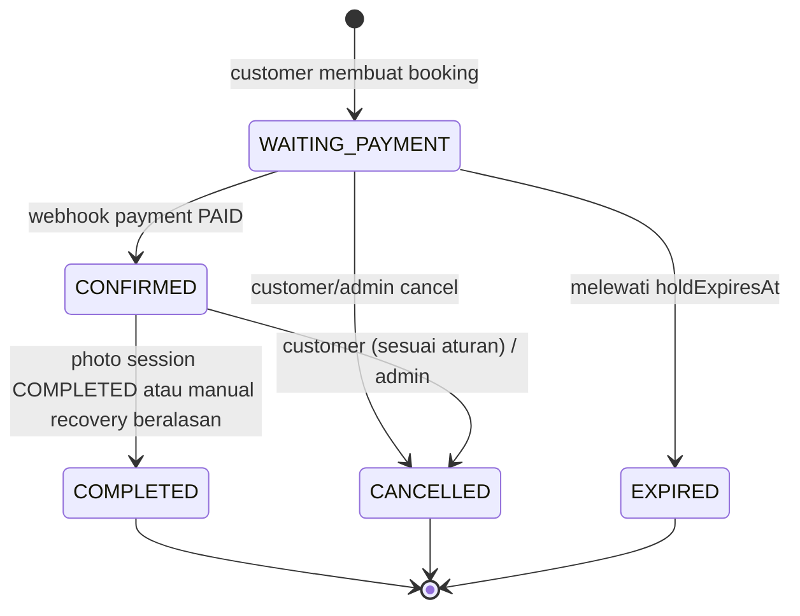
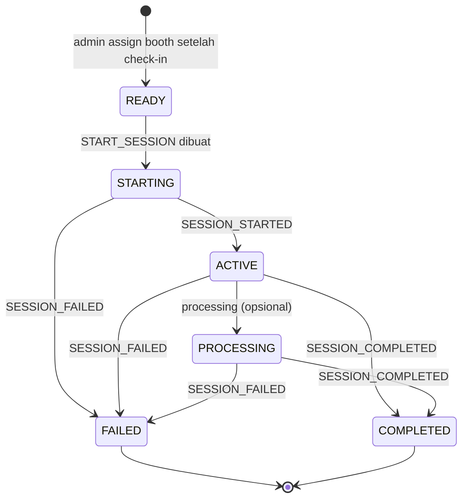

# Product Requirements Document

> Nama sementara: **Fotiu**
> Dokumen ini menjelaskan **APA** yang dibangun dan **MENGAPA**. Detail teknis ada di `DESIGN.md`.

## 1. Product Overview

Fotiu adalah aplikasi web untuk bisnis studio foto yang menyatukan proses booking, pembayaran, dan operasional sesi photobooth. Customer melihat paket, memilih jadwal kosong, membayar via QRIS, lalu datang ke studio. Admin memeriksa booking, melakukan check-in, memilih booth, memulai sesi, dan menyelesaikan booking setelah sesi benar-benar selesai.

Saat ini proses tersebut berjalan lewat chat manual. Customer harus bertanya jadwal kosong, admin mencatat booking sendiri, dan pembayaran terpisah dari data booking. Aplikasi ini menggantikan alur tersebut dengan alur yang otomatis dan konsisten:

Browse Package → Google Login → Select Schedule → Booking → QRIS Payment → Payment Verified → Booking Confirmed → Admin Check-in → Assign Booth → Photo Session → Booking Completed

Fotiu menghubungkan cloud application dengan komputer booth lokal melalui Local Booth Agent. Produk P0 tidak bergantung pada software atau vendor photobooth tertentu: `MockBoothProvider` membuat alur dapat dikembangkan dan diuji tanpa kamera, printer, lisensi, atau software berbayar. Integrasi provider nyata adalah P1.

Produk ini juga proyek portfolio yang dikerjakan oleh satu developer. Karena itu scope dijaga kecil dan realistis. Fokusnya satu studio, satu alur end-to-end yang benar-benar berjalan, dan beberapa masalah teknis nyata: double booking, webhook payment, dan authorization.

## 2. Problem Statement

| Masalah | Dampak |
|---|---|
| Customer harus bertanya jadwal kosong lewat chat | Lambat, customer bisa pindah ke studio lain |
| Admin mencatat booking manual | Data tidak terorganisir, rawan salah catat |
| Jadwal bisa bentrok | Dua customer dijanjikan slot yang sama |
| Customer sulit melihat status booking | Banyak pertanyaan berulang ke admin |
| Pembayaran dan booking tidak terhubung | Admin harus mencocokkan bukti transfer manual |
| Booking yang sudah dibayar tidak terhubung ke komputer booth | Admin harus memulai dan memantau sesi photobooth secara terpisah |

## 3. Product Goals

### Business Goals
- Mengurangi proses booking manual lewat chat.
- Menghilangkan bentrok jadwal.
- Semua booking dan pembayaran tercatat di satu sistem.
- Pembayaran terverifikasi otomatis tanpa pengecekan manual admin.
- Booking yang sudah check-in terhubung ke sesi booth yang benar tanpa mengunci produk ke vendor software tertentu.

### User Goals
- **Customer:** melihat slot kosong sendiri, booking dan bayar dalam beberapa menit, dan melihat status booking kapan saja.
- **Admin:** melihat semua booking, jadwal, dan status pembayaran di satu dashboard.
- **Admin studio:** check-in customer yang memenuhi syarat, memilih booth yang siap, memulai sesi, dan mengetahui hasil sesi.

### Portfolio Goals
- Demo end-to-end yang bisa dicoba secara live: login Google, booking, bayar QRIS sandbox, dan booking menjadi CONFIRMED.
- Demo workflow operasional P0 memakai Local Booth Agent dan MockBoothProvider tanpa perangkat atau lisensi berbayar.
- Menunjukkan penanganan concurrency, webhook idempotent, dan authorization yang benar.
- Dokumentasi dan riwayat commit yang rapi.

### Learning Goals
- Google OAuth dan credentials auth dalam satu aplikasi.
- Database transaction dan constraint untuk mencegah race condition.
- Webhook signature verification dan idempotency.
- Authorization server-side dan pencegahan IDOR.
- Penanganan timezone.
- Menulis test untuk business rule dan race condition.
- Integrasi perangkat lokal melalui agent, command/event idempotent, dan state machine terpisah.

## 4. Non-Goals

Sengaja **tidak** dikerjakan pada MVP:

- Multi-branch, multi-studio, atau lebih dari satu sesi paralel.
- Manajemen staf dan fotografer.
- Loyalty, membership, promo, dan voucher.
- Review dan rating.
- Chat dan WhatsApp automation.
- Fitur AI dan aplikasi mobile.
- Automatic refund. Refund dilakukan manual di luar sistem.
- Multiple payment provider dan sistem notifikasi kompleks.
- Integrasi beberapa provider photobooth nyata pada P0; P0 menggunakan mock provider.
- Kontrol kamera, printer, atau hardware langsung dari cloud.
- Remote desktop, OS management, automatic agent updater, dan complex offline synchronization.
- Message broker, distributed event streaming, IoT platform, atau microservices.
- Advanced analytics dan akuntansi.
- Pembayaran DP atau cicilan. MVP hanya pembayaran penuh.
- Reschedule oleh customer. Hanya admin yang bisa reschedule.

## 5. Target Users

### Customer

**Kebutuhan**
- Tahu paket, harga, dan durasi dengan jelas.
- Tahu jadwal kosong tanpa bertanya.
- Bayar dengan mudah, terutama dari HP.

**Masalah**
- Balasan chat lambat.
- Tidak tahu apakah booking sudah pasti.
- Tidak punya riwayat booking.

**Tujuan**
- Mendapat slot foto pada waktu yang diinginkan dengan kepastian penuh.

### Admin

**Kebutuhan**
- Melihat seluruh booking dan jadwal dalam satu tempat.
- Mengatur paket dan jam operasional.
- Menangani perubahan seperti reschedule dan cancel.

**Masalah**
- Pencatatan manual dan bentrok jadwal.
- Rekonsiliasi pembayaran manual.

**Tujuan**
- Operasional booking berjalan dengan campur tangan minimal, kecuali untuk pengecualian.

## 6. Core User Journey

**Customer**

Browse → Package → Login (Google) → Schedule → Booking (`WAITING_PAYMENT`, slot ditahan) → Payment (QRIS) → Confirmation (`CONFIRMED` otomatis via webhook) → Datang ke studio.

**Admin**

Login → Dashboard → Booking (lihat/kelola) → Check-in booking terkonfirmasi dan lunas → Assign booth online → Start photo session → Pantau hasil sesi → Booking completed setelah sesi selesai (atau manual recovery dengan alasan).

**P0 system flow**

Cloud menyimpan command `START_SESSION`; Local Booth Agent mengambilnya melalui HTTPS polling, meneruskannya ke provider adapter, lalu mengirim normalized event ke cloud. P0 menggunakan `MockBoothProvider`. Booking dan photo session memiliki status terpisah.

## 7. Functional Requirements

### Public
| ID | Requirement |
|---|---|
| FR-001 | Guest dapat melihat daftar package aktif tanpa login. |
| FR-002 | Guest dapat melihat detail package (deskripsi, harga, durasi, foto). |
| FR-003 | Guest dapat melihat gallery. |
| FR-004 | Guest dapat melihat informasi studio (alamat, jam operasional, kontak). |
| FR-005 | Guest yang membuka halaman customer/admin diarahkan ke halaman login yang sesuai. |

### Customer
| ID | Requirement |
|---|---|
| FR-010 | Customer login menggunakan Google OAuth. Tidak ada email/password untuk customer. |
| FR-011 | Customer dapat logout. |
| FR-012 | Customer dashboard menampilkan upcoming booking dan tombol booking baru. |
| FR-013 | Customer dapat melihat daftar booking (upcoming dan history). |
| FR-014 | Customer dapat melihat detail booking miliknya sendiri. |

### Booking
| ID | Requirement |
|---|---|
| FR-020 | Customer harus login sebelum membuat booking. |
| FR-021 | Customer dapat melihat slot tersedia per package dan per tanggal. |
| FR-022 | Customer dapat membuat booking. Status awal WAITING_PAYMENT dan slot ditahan. |
| FR-023 | Sistem mencegah double booking, termasuk pada request bersamaan. |
| FR-024 | Customer maksimal memiliki 2 booking WAITING_PAYMENT aktif. |
| FR-025 | Booking WAITING_PAYMENT yang melewati batas waktu otomatis menjadi EXPIRED. |
| FR-026 | Customer dapat membatalkan booking sesuai aturan (BR-010). |
| FR-027 | Booking menyimpan snapshot nama dan harga package saat dibuat. |

### Payment
| ID | Requirement |
|---|---|
| FR-030 | Sistem membuat pembayaran QRIS untuk booking. |
| FR-031 | Customer melihat QR, sisa waktu, dan status pembayaran. Halaman memperbarui status otomatis. |
| FR-032 | Sistem menerima webhook dari payment provider dan memverifikasi signature. |
| FR-033 | Webhook sukses mengubah payment menjadi PAID dan booking menjadi CONFIRMED secara atomik. |
| FR-034 | Pemrosesan webhook idempotent. Event duplikat tidak menghasilkan efek ganda. |
| FR-035 | Redirect atau request dari client tidak pernah mengubah status payment. |
| FR-036 | Payment gagal atau expired dicatat, dan booking tidak menjadi CONFIRMED. |
| FR-037 | Pembayaran yang masuk setelah booking EXPIRED/CANCELLED ditandai *needs review* untuk penanganan manual admin. |
| FR-038 | Admin dapat menandai payment sebagai REFUNDED setelah refund manual. |

### Admin
| ID | Requirement |
|---|---|
| FR-040 | Admin login dengan email dan password. Tidak ada registrasi publik. |
| FR-041 | Dashboard menampilkan ringkasan booking, sesi mendatang, dan pendapatan sederhana. |
| FR-042 | Admin dapat melihat dan memfilter daftar booking (status, tanggal, pencarian). |
| FR-043 | Admin dapat melihat detail booking (customer, package, payment). |
| FR-044 | Admin dapat reschedule booking CONFIRMED ke slot yang valid. |
| FR-045 | Admin dapat membatalkan booking. |
| FR-046 | Booking menjadi COMPLETED setelah photo session COMPLETED; admin dapat melakukan manual completion hanya sebagai recovery dengan alasan yang dicatat. |
| FR-047 | Admin dapat melihat daftar customer. |
| FR-048 | Admin dapat melihat status payment setiap booking. |
| FR-049 | Admin dapat melihat calendar booking. |

### Package
| ID | Requirement |
|---|---|
| FR-050 | Admin dapat create, read, update package. |
| FR-051 | Admin dapat menonaktifkan dan mengaktifkan package. |
| FR-052 | Package hanya bisa dihapus permanen jika belum pernah memiliki booking. |
| FR-053 | Admin dapat mengunggah foto package dan gallery. |

### Schedule
| ID | Requirement |
|---|---|
| FR-060 | Admin dapat mengatur jam operasional per hari dalam seminggu. |
| FR-061 | Admin dapat memblokir rentang waktu tertentu (libur, maintenance). |
| FR-062 | Availability dihitung dari durasi package, jam operasional, blokir, dan booking aktif. |
| FR-063 | Ada batas minimum lead time dan maksimum hari ke depan untuk booking. |

### Photobooth Operations
| ID | Requirement |
|---|---|
| FR-070 | Admin dapat melihat booth dan status ONLINE, OFFLINE, BUSY, atau MAINTENANCE. |
| FR-071 | Local Booth Agent mengautentikasi sebagai device tersendiri dan mengirim heartbeat berkala. |
| FR-072 | Sistem menentukan status ONLINE/OFFLINE dari waktu heartbeat dan timeout yang dapat dikonfigurasi. |
| FR-073 | Admin hanya dapat check-in booking CONFIRMED, payment PAID, tidak terminal, dan sesuai waktu/jadwal sesi. |
| FR-074 | Setelah check-in, admin dapat assign booth ONLINE yang tidak BUSY atau MAINTENANCE dan tidak memiliki active photo session. |
| FR-075 | Assignment membuat photo session READY yang terpisah dari status booking. Satu booking boleh memiliki beberapa photo session sepanjang hanya satu yang aktif. |
| FR-076 | Admin dapat meminta `START_SESSION`; sistem membuat command idempotent dan agent meneruskannya melalui provider adapter. |
| FR-077 | Sistem menerima normalized event SESSION_STARTED, SESSION_COMPLETED, dan SESSION_FAILED; event duplikat tidak mengulang transisi. |
| FR-078 | Pengiriman command atau status command SUCCESS tidak dianggap sebagai bukti sesi sudah dimulai atau selesai. |
| FR-079 | Booking tidak menjadi COMPLETED pada SESSION_FAILED; admin dapat memulai recovery yang tercatat. |
| FR-080 | Core MVP berjalan memakai MockBoothProvider yang dapat mensimulasikan sukses, gagal, unavailable, dan respons tertunda tanpa hardware. |
| FR-081 | Integrasi provider nyata hanya ditambahkan setelah P0 dan menggunakan mekanisme resmi yang terdokumentasi. |

## 8. Business Rules

| ID | Rule |
|---|---|
| BR-001 | Browse tanpa login. Membuat booking wajib login Google. |
| BR-002 | Customer hanya dapat mengakses booking miliknya. Admin dapat mengakses semua. |
| BR-003 | Slot tersedia jika berada dalam jam operasional, tidak overlap dengan blokir, tidak overlap dengan booking aktif, dan memenuhi lead time dan batas hari ke depan. Dihitung di server. |
| BR-004 | MVP hanya memiliki satu studio dan satu sesi photobooth aktif pada satu waktu; satu booth mock cukup untuk P0. Beberapa booth menjadi P2. |
| BR-005 | Booking baru menahan slot selama `BOOKING_HOLD_MINUTES` (default 15 menit, dapat dikonfigurasi). |
| BR-006 | Satu customer maksimal 2 booking WAITING_PAYMENT aktif, untuk mencegah penyalahgunaan hold. |
| BR-007 | Pembayaran penuh via QRIS. Nominal sama dengan harga package saat booking dibuat. |
| BR-008 | Payment menjadi PAID hanya berdasarkan webhook yang signature-nya valid. |
| BR-009 | Booking WAITING_PAYMENT yang lewat `holdExpiresAt` menjadi EXPIRED dan slot kembali tersedia. |
| BR-010 | Customer dapat membatalkan WAITING_PAYMENT kapan saja. Untuk CONFIRMED, pembatalan boleh sampai `CUSTOMER_CANCEL_DEADLINE_HOURS` (default 24 jam) sebelum sesi. Setelah itu hanya admin yang dapat membatalkan. |
| BR-011 | Tidak ada automatic refund. Booking CONFIRMED yang dibatalkan dengan payment PAID ditandai perlu refund manual. |
| BR-012 | Reschedule hanya oleh admin, hanya untuk CONFIRMED, package dan durasi tetap, dan slot baru harus valid menurut BR-003. |
| BR-013 | COMPLETED hanya dari CONFIRMED, setelah photo session COMPLETED dan waktu sesi memenuhi aturan operasional. Manual completion hanya untuk recovery dengan alasan, aktor, dan waktu tercatat. COMPLETED bersifat final. |
| BR-014 | Package yang sudah punya booking tidak boleh dihapus, hanya dinonaktifkan. Package nonaktif tidak tampil dan tidak bisa dibooking. Booking lama tetap valid. |
| BR-015 | Akun admin dibuat lewat seed/script, bukan registrasi publik. |
| BR-016 | Waktu disimpan dalam UTC dan ditampilkan dalam Asia/Jakarta. |
| BR-017 | Booking CANCELLED dan EXPIRED tidak memblokir slot. WAITING_PAYMENT (belum expired) dan CONFIRMED memblokir slot. |
| BR-018 | Perubahan harga package tidak memengaruhi booking yang sudah ada. |
| BR-PB-001 | Hanya booking CONFIRMED dengan payment PAID yang dapat check-in. |
| BR-PB-002 | Booking harus check-in sebelum booth assignment dan photo session dibuat/dimulai. |
| BR-PB-003 | Photo session hanya dapat dimulai pada booth ONLINE. |
| BR-PB-004 | Booth BUSY atau MAINTENANCE tidak dapat dipakai booking lain. Booth OFFLINE juga tidak dapat dipakai. |
| BR-PB-005 | Satu booth hanya boleh mempunyai satu active photo session. P0 juga membatasi satu active session studio. |
| BR-PB-006 | START_SESSION idempotent: pengiriman ulang command yang sama tidak boleh memulai sesi kedua. |
| BR-PB-007 | Command diterima/berstatus SUCCESS tidak berarti photo session ACTIVE atau COMPLETED. |
| BR-PB-008 | Photo session COMPLETED hanya dari normalized completion event atau manual recovery yang diotorisasi dan beralasan. |
| BR-PB-009 | SESSION_FAILED tidak boleh membuat booking COMPLETED. |
| BR-PB-010 | Booth tersedia kembali setelah sesi terminal dan tidak ada sesi aktif lain; kegagalan membutuhkan recovery/penutupan operasional sebelum booth dipakai lagi. |
| BR-PB-011 | Heartbeat segar menentukan online; status administrasi MAINTENANCE tetap menghalangi assignment. |
| BR-PB-012 | Provider-specific event tidak langsung menjadi business state; adapter menormalisasi event terlebih dahulu. |
| BR-PB-013 | Customer tidak dapat mengontrol booth atau membuat command booth. |
| BR-PB-014 | Hanya admin/authorized system operation dapat membuat START_SESSION. |
| BR-PB-015 | Provider nyata hanya memakai integration mechanism resmi/dokumentasi; dilarang reverse-engineer proprietary protocol. |

## 9. Booking Lifecycle

| Dari | Ke | Pemicu | Aktor |
|---|---|---|---|
| WAITING_PAYMENT | CONFIRMED | Webhook PAID tervalidasi | System |
| WAITING_PAYMENT | EXPIRED | `holdExpiresAt` lewat | System |
| WAITING_PAYMENT | CANCELLED | Cancel | Customer/Admin |
| CONFIRMED | COMPLETED | Photo session COMPLETED; atau manual recovery beralasan | System/Admin recovery |
| CONFIRMED | CANCELLED | Cancel sesuai BR-010 | Customer/Admin |

Status COMPLETED, CANCELLED, dan EXPIRED bersifat terminal. Transisi lain tidak diizinkan. Status dan state machine Photo Session terpisah dan tidak menggantikan booking lifecycle.

### Photo Session Lifecycle

Satu booking dapat memiliki nol atau beberapa photo session (mis. percobaan gagal lalu retry); maksimal satu percobaan aktif per booking dan satu sesi aktif pada booth. `FAILED` tidak membuat booking selesai. Retry setelah pemeriksaan/recovery membuat photo session baru, bukan menghapus histori percobaan.

Event provider dinormalisasi sebelum mengubah state. Command yang diterima bukan bukti sesi berjalan; completion hanya dari event completion atau manual recovery admin dengan alasan yang dicatat.

## 10. Payment Lifecycle

| Status | Arti |
|---|---|
| UNPAID | Record payment dibuat bersama booking, QRIS belum berhasil diterbitkan. |
| PENDING | QRIS sudah diterbitkan, menunggu pembayaran. |
| PAID | Webhook sukses tervalidasi diterima. |
| FAILED | Provider melaporkan pembayaran ditolak atau dibatalkan. |
| EXPIRED | QRIS atau hold melewati batas waktu tanpa pembayaran. |
| REFUNDED | Admin menandai bahwa refund manual sudah dilakukan (FR-038). Tidak ada refund otomatis. |

Alur normal: `UNPAID → PENDING → PAID`. Alur lain: `UNPAID/PENDING → FAILED`, `UNPAID/PENDING → EXPIRED`, dan `PAID → REFUNDED`. Status PAID hanya boleh berubah menjadi REFUNDED.

## 11. MVP Scope

Priority: **P0** = core MVP, **P1** = penting, **P2** = nice-to-have.

| Feature | User | Priority | Description |
|---|---|---|---|
| Landing, Packages, Package Detail | Guest | P0 | Halaman publik utama |
| Studio Information | Guest | P1 | Bagian di landing page |
| Gallery (tampil) | Guest | P1 | Galeri publik |
| Google OAuth + Logout | Customer | P0 | Login customer |
| Lihat slot tersedia | Customer | P0 | Kalkulasi server |
| Create Booking + slot hold | Customer | P0 | Inti sistem |
| QRIS Payment + tampilan status | Customer | P0 | Via payment gateway |
| Webhook verification + auto confirm | System | P0 | Sumber kebenaran payment |
| Expired booking handling | System | P0 | Melepas slot |
| My Bookings + Booking Detail | Customer | P0 | Status dan history |
| Customer Dashboard | Customer | P1 | Ringkasan upcoming |
| Cancel booking | Customer | P1 | Sesuai BR-010 |
| Admin Login | Admin | P0 | Credentials |
| Package CRUD | Admin | P0 | Kelola paket |
| Operating hours | Admin | P0 | Dasar availability |
| Booking Management + Detail | Admin | P0 | List, filter, detail |
| Complete Booking | Admin | P0 | Menutup siklus |
| Cancel Booking (admin) | Admin | P1 | Pengecualian operasional |
| Reschedule | Admin | P1 | Pindah slot |
| Schedule block | Admin | P1 | Libur atau maintenance |
| Calendar | Admin | P1 | Tampilan visual booking |
| Admin Dashboard | Admin | P1 | Ringkasan sederhana |
| Customer List | Admin | P1 | Daftar customer |
| Upload gambar package/gallery | Admin | P1 | Object storage |
| Late payment flag (needs review) | Admin | P1 | FR-037 |
| Mark REFUNDED manual | Admin | P2 | FR-038 |
| Rate limiting endpoint sensitif | System | P1 | Login dan booking |
| Booth, photo session, dan command | Admin/System | P0 | Domain provider-agnostic, satu booth mock |
| Local Booth Agent + heartbeat | System | P0 | Polling HTTPS, device credential, ONLINE/OFFLINE |
| MockBoothProvider | System | P0 | Simulasi sukses, gagal, unavailable, delayed |
| Check-in, booth assignment, START_SESSION | Admin | P0 | Hanya booking CONFIRMED + PAID dan booth tersedia |
| Normalized session events dan completion | System/Admin | P0 | Sesi selesai menentukan booking completion |
| Satu real provider | Admin/System | P1 | Dipilih berdasarkan integrasi resmi dan kelayakan uji |
| QR check-in dan customer session status | Customer | P1/P2 | Perluasan setelah alur admin P0 |
| Multi-booth, multi-branch, multi-provider | Admin | P2 | Bukan prasyarat MVP |

## 12. User Stories

**US-001** Sebagai customer, saya ingin melihat paket dan harga tanpa login, agar bisa menilai dulu sebelum mendaftar.
- [ ] Halaman `/packages` dan detail dapat dibuka tanpa login.
- [ ] Hanya package aktif yang tampil.

**US-002** Sebagai customer, saya ingin login dengan Google, agar tidak perlu membuat password.
- [ ] Setelah login Google, saya kembali ke halaman yang saya tuju.
- [ ] Akun customer dibuat otomatis saat login pertama.
- [ ] Tidak ada form email/password untuk customer.

**US-003** Sebagai customer, saya ingin melihat slot kosong pada tanggal tertentu, agar tidak perlu bertanya ke admin.
- [ ] Slot yang sudah dibooking atau ditahan tidak tampil sebagai tersedia.
- [ ] Slot di luar jam operasional atau yang diblokir tidak tampil.
- [ ] Slot sudah memperhitungkan durasi package.

**US-004** Sebagai customer, saya ingin membuat booking untuk slot terpilih, agar slot tersebut diamankan untuk saya.
- [ ] Booking dibuat dengan status WAITING_PAYMENT dan batas waktu bayar jelas.
- [ ] Jika slot sudah diambil orang lain, saya mendapat pesan yang jelas dan bisa memilih slot lain.

**US-005** Sebagai customer, saya ingin membayar lewat QRIS, agar pembayaran cepat dan mudah.
- [ ] QR dan sisa waktu tampil di halaman booking.
- [ ] Setelah bayar, status berubah menjadi CONFIRMED otomatis tanpa perlu refresh manual.
- [ ] Jika browser ditutup setelah bayar, booking tetap CONFIRMED.

**US-006** Sebagai customer, saya ingin melihat daftar dan detail booking saya, agar tahu status dan jadwal sesi.
- [ ] Ada pemisahan upcoming dan history.
- [ ] Saya tidak bisa membuka booking milik orang lain (mendapat 404).

**US-007** Sebagai customer, saya ingin membatalkan booking yang belum dibayar atau masih memenuhi aturan, agar slot tidak terbuang.
- [ ] WAITING_PAYMENT dapat dibatalkan dan slot langsung tersedia lagi.
- [ ] CONFIRMED dalam batas waktu 24 jam ditolak dengan pesan yang jelas.

**US-008** Sebagai admin, saya ingin login dan melihat ringkasan operasional, agar tahu kondisi hari ini.
- [ ] Login hanya dengan email dan password.
- [ ] Dashboard menampilkan jumlah booking per status, sesi mendatang, dan total pendapatan dari payment PAID.

**US-009** Sebagai admin, saya ingin mengelola package dan jam operasional, agar jadwal dan katalog sesuai kondisi studio.
- [ ] Perubahan jam operasional memengaruhi availability berikutnya.
- [ ] Package yang punya booking tidak bisa dihapus, hanya dinonaktifkan.

**US-010** Sebagai admin, saya ingin reschedule, cancel, dan complete booking, agar bisa menangani perubahan di lapangan.
- [ ] Reschedule ke slot terisi ditolak dengan pesan konflik.
- [ ] Booking COMPLETED tidak bisa dibatalkan atau dijadwalkan ulang.
- [ ] Booking hanya complete setelah photo session selesai, kecuali manual recovery beralasan.

**US-011** Sebagai admin, saya ingin check-in customer dan memilih booth yang siap, agar sesi photobooth terhubung ke booking yang sudah dibayar.
- [ ] Check-in ditolak untuk booking yang belum CONFIRMED/PAID atau tidak berada pada jadwalnya.
- [ ] Booth offline, busy, atau maintenance tidak dapat di-assign.

**US-012** Sebagai admin, saya ingin memulai dan memantau sesi photobooth dari booking, agar hasil sesi tercatat dengan benar.
- [ ] START_SESSION dikirim melalui agent dan mock provider pada P0.
- [ ] Booking tidak selesai hanya karena command terkirim; event completion yang dinormalisasi menyelesaikan sesi.

## 13. Edge Cases

| Kasus | Perilaku yang diharapkan |
|---|---|
| Double booking (dua customer, slot sama, bersamaan) | Tepat satu berhasil. Yang lain mendapat error konflik. Dijamin oleh database. |
| Payment gagal | Payment FAILED, booking tidak CONFIRMED. Booking menjadi EXPIRED saat hold habis. |
| Payment berhasil tetapi browser ditutup | Webhook tetap mengonfirmasi booking. Customer melihat CONFIRMED saat membuka lagi. |
| Webhook datang dua kali | Event kedua diabaikan secara aman. Tidak ada perubahan ganda, response tetap sukses. |
| Payment expired | Payment EXPIRED, booking EXPIRED, slot tersedia lagi. |
| Payment PAID datang setelah booking EXPIRED/CANCELLED | Payment dicatat PAID, booking tidak berubah, ditandai *needs review* untuk refund manual. |
| Customer mengakses booking orang lain | Response 404. Tidak membocorkan keberadaan data. |
| Admin reschedule ke slot yang sudah terisi | Ditolak dengan error konflik. Booking tetap di slot lama. |
| Cancel booking setelah COMPLETED | Ditolak. Transisi tidak valid. |
| Package nonaktif tetapi booking lama masih ada | Booking lama tetap tampil dengan snapshot nama dan harga. Package tidak bisa dibooking baru. |
| Webhook dengan signature salah | Ditolak dan tidak mengubah data apa pun. Dicatat di log. |
| Nominal webhook tidak sama dengan nominal payment | Ditolak dan dicatat sebagai anomali. |
| Customer membuka banyak booking untuk menahan slot | Dibatasi maksimal 2 WAITING_PAYMENT aktif. |
| Pembuatan QRIS ke provider gagal | Booking tetap WAITING_PAYMENT, customer dapat mencoba membuat QRIS lagi selama hold belum habis. |
| Booth offline sebelum sesi | Assignment/start ditolak; booking tetap CONFIRMED dan sesi tidak dianggap berjalan. |
| Booth offline setelah session dimulai | Sesi tetap pada state terakhir yang diketahui atau masuk recovery; tidak otomatis dianggap COMPLETED. |
| START_SESSION terkirim berulang | Command idempotency mencegah sesi kedua. |
| Provider gagal setelah command diterima | Command FAILED dan photo session FAILED/needs recovery; booking tetap bukan COMPLETED. |
| SESSION_COMPLETED diterima berulang | Event idempotent; transisi dan completion booking hanya terjadi satu kali. |
| Agent restart | Agent mengautentikasi kembali, melanjutkan heartbeat dan mengambil command pending; hasil yang tidak pasti direkonsiliasi, bukan dianggap sukses. |
| Cloud sementara tidak tersedia | Agent tidak melaporkan fake success; event dikirim ulang dengan ID event yang sama bila dapat disimpan lokal. P0 tidak menjanjikan offline event queue kompleks. |
| Booking dibatalkan saat command masih PENDING | Cloud menolak/menandai command agar tidak dieksekusi setelah memeriksa status booking. |
| Booth sibuk saat assignment baru | Server menolak assignment; constraint database menjadi penjaga akhir untuk active session. |
| Provider tidak memiliki event sesi | Capability dinyatakan unsupported atau strategi fallback resmi didokumentasikan; tidak membuat completion palsu. |
| Provider nyata belum tersedia | MockBoothProvider tetap mendukung alur P0 tanpa lisensi/hardware. |

## 14. Non-Functional Requirements

- **Security:** Authorization server-side, validasi input, webhook diverifikasi, secret hanya di environment variable, password admin di-hash.
- **Performance:** Halaman publik terasa cepat. Kalkulasi availability satu hari cukup ringan untuk satu studio.
- **Reliability:** Konsistensi booking dijamin database. Operasi kritis memakai transaction. Webhook aman dari duplikasi dan retry.
- **Responsive Design:** Halaman customer mobile-first. Admin desktop-first tetapi tetap dapat dipakai di tablet dan HP.
- **Accessibility:** Semantic HTML, kontras cukup, form ber-label, navigasi keyboard dasar.
- **Maintainability:** Modular monolith, TypeScript strict, test untuk business rule penting, dokumentasi selalu diperbarui.
- **Photobooth integration:** provider-agnostic, satu Local Booth Agent sederhana, command/event tervalidasi, tanpa broker atau kontrol hardware cloud.

## 15. MVP Acceptance Criteria

- [ ] Guest dapat melihat landing, packages, package detail, dan gallery.
- [ ] Customer dapat login dengan Google dan logout.
- [ ] Customer melihat slot tersedia yang benar untuk package dan tanggal.
- [ ] Customer dapat membuat booking dan slot ditahan selama hold.
- [ ] Dua booking bersamaan pada slot sama: tepat satu berhasil (terbukti dengan test).
- [ ] QRIS sandbox dapat dibuat dan dibayar, lalu webhook membuat booking CONFIRMED otomatis.
- [ ] Webhook duplikat tidak menyebabkan efek ganda.
- [ ] Webhook dengan signature salah ditolak.
- [ ] Booking yang tidak dibayar menjadi EXPIRED dan slotnya tersedia lagi.
- [ ] Customer melihat upcoming, history, dan detail booking miliknya, dan tidak bisa mengakses milik orang lain.
- [ ] Customer dapat membatalkan booking sesuai aturan.
- [ ] Admin dapat login, melihat dashboard, dan mengelola booking (filter, detail, reschedule, cancel, complete).
- [ ] Admin dapat CRUD package dan mengatur jam operasional serta blokir jadwal.
- [ ] Admin melihat calendar dan customer list.
- [ ] Core tidak bergantung pada vendor photobooth; MockBoothProvider menjalankan simulasi tanpa hardware.
- [ ] Agent mengautentikasi terpisah, mengirim heartbeat, dan cloud membedakan booth ONLINE/OFFLINE.
- [ ] Admin check-in hanya booking CONFIRMED + PAID, lalu assign booth yang tersedia.
- [ ] START_SESSION idempotent; event SESSION_STARTED/COMPLETED/FAILED dinormalisasi dan dedup aman.
- [ ] Booking hanya COMPLETED setelah session selesai atau manual recovery beralasan; SESSION_FAILED tidak menyelesaikan booking.
- [ ] Seluruh workflow P0 berjalan tanpa software photobooth berbayar.
- [ ] Semua mutation divalidasi dan diotorisasi di server.
- [ ] Aplikasi ter-deploy di Vercel dan lolos smoke test end-to-end.

## 16. Future Improvements

Di luar MVP, dapat dipertimbangkan kemudian:

- Automatic refund dan kebijakan refund bertahap.
- Pembayaran DP atau cicilan.
- Reschedule oleh customer.
- Notifikasi email atau WhatsApp (reminder sesi).
- Multi-room, multi-studio, dan manajemen fotografer.
- Promo, voucher, loyalty.
- Review dan rating.
- Riwayat perubahan status (audit log) dan analytics lebih lengkap.
- Integrasi Google Calendar.
- Multiple payment provider.
- Multiple real photobooth adapters, multi-booth, dan multi-branch.
- Self check-in QR, status sesi customer, automatic photo delivery/gallery, dan signed photo download URL.
- Remote booth configuration, diagnostics, print queue monitoring, advanced booth analytics, staff/photographer assignment, dan session audit timeline lanjutan.
